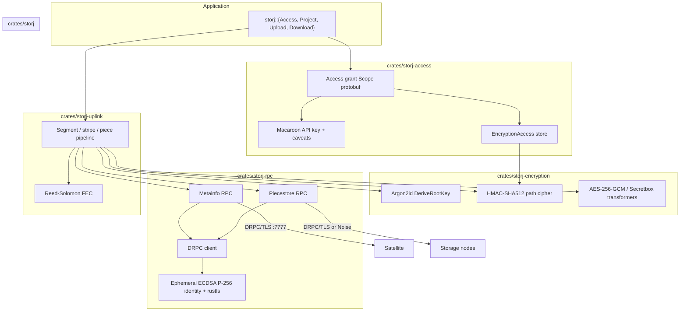
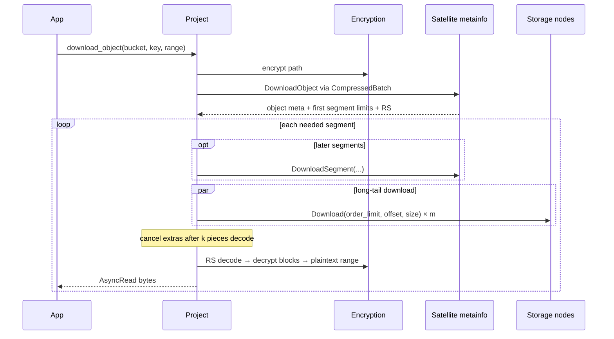

# Native Rust Uplink API for Storj

| Field | Value |
|---|---|
| **Title** | Native Rust Uplink API for Storj |
| **Author** | TBD |
| **Date** | 2026-09-01 (1.0.0 on `main` 2026-09-02) |
| **Status** | Implemented |
| **Audience** | Engineers using or changing `storj-uplink` |
| **Repo** | `storj-uplink` (`main` is 1.0.0) |
| **Analog** | Go [`storj.io/uplink`](https://pkg.go.dev/storj.io/uplink) v1.14.5; prior Rust [`uplink` 0.11.0](https://docs.rs/uplink/0.11.0/uplink/) (FFI, May 2025) |

---

## Overview

Storj is a decentralized object store: an **Uplink** client encrypts object keys and content, erasure-codes segments, and talks **DRPC** (not gRPC, not HTTP) to a **Satellite** (metadata / authorization) and many **storage nodes** (piecestore). Credentials are **access grants**: a satellite address, a macaroon API key, and a hierarchical encryption store, serialized as Base58Check protobuf.

This document specifies a **native Rust client library** for that protocol, analogous to Go `libuplink` — not a rewrite of the satellite or storage-node services, and not an S3 SDK. The public surface mirrors `storj.io/uplink` (`Access`, `Project`, `Bucket`, `Object`, `Upload`, `Download`) but is async-first (Tokio), uses Rust ownership for streams, and never requires a Go toolchain.

The crate is a **native protocol implementation**. Existing Rust bindings (`uplink` / `uplink-sys` on crates.io) wrap `uplink-c` via FFI and inherit CGo, blocking I/O, and a Go compiler. Those crates are acknowledged, not reused as the implementation. We keep the **domain vocabulary** of `uplink` 0.11.0 so 2025 users can migrate, but this is **not source-compatible** and is **not** published as `uplink`. Interop with Go uplink is a **hard requirement**: access grants, encrypted paths, and objects produced here must be usable by `storj.io/uplink` and production satellites.

---

## Background & Motivation

### Current state

- **Canonical client:** [`github.com/storj/uplink`](https://github.com/storj/uplink) (`storj.io/uplink`), MIT, latest documented release **v1.14.5** (Go docs dated 2026-08-18).
- **C ABI:** [`github.com/storj/uplink-c`](https://github.com/storj/uplink-c) — cgo wrapper of Go uplink. Python, PHP, Node, Java, Ruby, and the existing Rust bindings all wrap this.
- **Existing Rust:** [`storj-thirdparty/uplink-rust`](https://github.com/storj-thirdparty/uplink-rust) publishes `uplink` 0.11.0 (MIT) and `uplink-sys` 0.8.0 (Apache-2.0), last crates.io release **2025-05-30**. Status is explicitly **beta**; build requires Go; ~21k all-time downloads. No production references are claimed.
- **Native access-grant-only library:** [`storj/access-python`](https://github.com/storj/access-python) shows Storj itself is willing to reimplement grant restriction outside Go for languages that need it. Object I/O in Python is officially steered toward **boto3 + GatewayMT** ([forum, 2024-02](https://forum.storj.io/t/best-practice-for-using-storj-in-a-python-environment/25359)).
- **S3:** Hosted GatewayMT (`https://gateway.storjshare.io`) and self-hosted GatewayST. S3 is a gateway concern, not an Uplink concern.

### Pain points this crate addresses

1. **Go-in-the-build.** `uplink-c` / `uplink-sys` require a Go compiler and produce a cgo shared library. That is unacceptable for many Rust apps, musl, and cross-compilation.
2. **Blocking FFI.** `uplink-c` is synchronous. Mapping it onto Tokio requires worker threads and loses cancellation/backpressure fidelity.
3. **No first-class Rust API.** The FFI crate cannot express `AsyncRead`/`AsyncWrite`, `Stream`, or `Drop`-based abort.
4. **Protocol ownership.** A native crate can be reviewed, fuzzed, and versioned as Rust. Encryption bugs in FFI are un-auditable from the Rust side.

### Why not rewrite satellite / storage-node

Satellite and storage-node are AGPL services with databases, overlay, repair, and billing. An Uplink is a **client**. Scope is the client protocol only.

---

## Prior art: `uplink` 0.11.0 (May 2025)

Last published Rust Storj client: crates.io [`uplink` 0.11.0](https://docs.rs/uplink/0.11.0/uplink/) (2025-05-30) from [`storj-thirdparty/uplink-rust`](https://github.com/storj-thirdparty/uplink-rust), wrapping [`uplink-sys` 0.8.0](https://crates.io/crates/uplink-sys) / [`uplink-c`](https://github.com/storj/uplink-c). MIT (`uplink`) / Apache-2.0 (`uplink-sys`). Status: **beta**, ~21k all-time downloads, no claimed production users. **Build requires Go + clang.** Docs: <https://docs.rs/uplink/0.11.0/uplink/>.

This crate is the Rust API 2025 users actually wrote against. We map it method-by-method so a native `storj` crate is a **migration**, not a surprise. We do **not** wrap it, depend on it, or publish under the `uplink` name (Key Decision K13).

Crate root (2025): `Bucket`, `Error`, `Object`, `Project`, `Config`, `EncryptionKey`, `Result<T>`. Modules: `access`, `bucket`, `docs`, `edge`, `error`, `metadata`, `object`, `project`.

### What we keep vs what we change

**Keep (domain vocabulary — 2025 users should recognize the crate):**

- Types: `Project`, `Bucket`, `Object`, `Upload`, `Download`, `EncryptionKey`, `Config`, `Permission`, `SharePrefix`
- Operations: parse/serialize/share grants; request grant from passphrase; override encryption key; open project; bucket CRUD including `ensure_bucket` and `delete_bucket_with_objects`; object upload/download/stat/delete/list/copy/move; multipart begin/part/commit/abort/list; `revoke_access`; `update_object_metadata`
- User-visible error *codes*: canceled, too-many-requests, bandwidth/storage/segments limit, permission denied, bucket name/exists/not-empty/not-found, object key/not-found, upload-done, plus edge-auth failures when the edge module exists
- Prefix-must-end-with-`/` rule for `override_encryption_key` and list prefixes
- `Config` user-agent and dial timeout

**Deliberately change (FFI artifacts — do not carry forward):**

| 2025 | New `storj` | Why |
|---|---|---|
| Blocking `std::io::Read`/`Write` | Tokio `AsyncRead`/`AsyncWrite`; `blocking` feature re-implements std I/O | Native async; 2025 is cgo-blocking |
| `Project`, `Grant`, `Download`, `Config`, `EncryptionKey`, `edge::Config` are `!Send + !Sync` (raw `*mut` handles) | All public types **`Send + Sync`** | Required for Tokio tasks and `Arc<Project>` |
| `Project::open(...) -> Self` (infallible) | `open` / `open_with_config` → `Result<Self>` | Native connect/dial/TLS can fail; 2025 deferred failure to first RPC |
| `access::Grant` | `Access` | Go uplink name; document the rename. No `Grant` type alias (would imply drop-in) |
| `Grant::new(s)` | `Access::parse(s)` | `new` is not a constructor from a serialized token |
| `create_bucket` → `(Bucket, bool)` | `Result<Bucket>` + `ErrorKind::BucketAlreadyExists` **with `Error::bucket()` set** | Match Go dual return (bucket + error), not the 2025 bool. `ensure_bucket` for create-or-get |
| `delete_object` → `Option<Object>` | `Result<Option<Object>>` | Keep 2025 `Option`: Go success with nil object when grant lacks read |
| `Error::{Internal, InvalidArguments, Uplink(Uplink)}` | Flat `Error` + `ErrorKind` | No FFI layer. Drop `InvalidHandle`. Do not mention handles in messages |
| `UplinkError` codes that are handle bugs (`InvalidHandle`, `Internal` from C) | Drop | Not a user-visible Storj failure |
| `&mut Custom` / `&mut CommitUpload` for FFI conversion | Owned `CustomMetadata` / `CommitUploadOptions` by value | Mutation was only for C struct materialization |
| `Config<'a>` with `temp_dir` / `new_inmemory` | Owned `Config` without temp-dir | Disk offload is an FFI implementation detail; native streaming does not need it |
| Go at **build** time | **Never** | Hard product requirement |
| Pull iterators (`Next`/`Item`) | `futures::Stream` (blocking feature may offer iterators) | Idiomatic Rust |
| Crate name `uplink` | Crate name `storj` | `uplink` is taken; not a drop-in |

### Explicit deltas (normative)

1. **I/O model.** 2025 `object::Download` impls `std::io::Read`; `object::upload::Upload` impls `std::io::Write`. New crate: `tokio::io::{AsyncRead, AsyncWrite}` on `Download`/`Upload`. Feature `blocking` exposes `storj::blocking::{Upload, Download}` that impl `std::io::{Read, Write}` via `block_on`.
2. **Thread safety.** 2025 auto-traits: `Project`, `Grant`, `Download`, `Config`, `EncryptionKey`, `edge::Config` are `!Send + !Sync` because they hold FFI pointers. New types **must** be `Send + Sync` (compile-time `assert_send_sync` in `crates/storj/src/lib.rs`).
3. **`Project::open` fallibility.** 2025 is infallible (`-> Self`) because `uplink_open_project` errors were historically ignored or panicking-path; first use failed later. Native open dials the satellite, verifies NodeID, and **must** return `Result`.
4. **`Grant` → `Access`.** Same object. README migration table: `uplink::access::Grant` → `storj::Access`.
5. **`create_bucket`.** 2025 returns `(Bucket, true)` on create and `(Bucket, false)` if it already existed (never `BucketAlreadyExists` for that path). We follow **Go** `CreateBucket`: success only when created; already-exists is `ErrorKind::BucketAlreadyExists` **and** `Error::bucket()` holds the existing `Bucket` (Go returns both). Callers that wanted the bool use `ensure_bucket` or `e.bucket()`.
6. **Errors.** Map every *user-visible* 2025 `error::Uplink` variant onto `ErrorKind`. Do **not** expose FFI/`Uplink` wrapping or `InvalidHandle`.

| 2025 `error::Uplink` | New `ErrorKind` | Notes |
|---|---|---|
| `Canceled` | `Canceled` | Keep |
| `TooManyRequests` | `TooManyRequests` | Keep |
| `BandwidthLimitExceeded` | `BandwidthLimitExceeded` | Keep |
| `StorageLimitExceeded` | `StorageLimitExceeded` | Keep |
| `SegmentsLimitExceeded` | `SegmentsLimitExceeded` | Keep |
| `PermissionDenied` | `PermissionDenied` | Keep |
| `BucketNameInvalid` | `BucketNameInvalid` | Keep |
| `BucketAlreadyExists` | `BucketAlreadyExists` | Keep |
| `BucketNotEmpty` | `BucketNotEmpty` | Keep |
| `BucketNotFound` | `BucketNotFound` | Keep |
| `ObjectKeyInvalid` | `ObjectKeyInvalid` | Keep |
| `ObjectNotFound` | `ObjectNotFound` | Keep |
| `UploadDone` | `UploadDone` | Keep |
| `EdgeAuthDialFailed` | `EdgeAuthDialFailed` | Kind exists in v1; **returned only by `storj::edge` (v1.x)** |
| `EdgeRegisterAccessFailed` | `EdgeRegisterAccessFailed` | Same |
| `InvalidHandle` | **drop** | FFI handle bug, not a Storj error |
| `Internal` / `Unknown` | `Protocol` or `Io` | Never mention C/FFI |
| `Error::InvalidArguments` | `BucketNameInvalid` / `ObjectKeyInvalid` / `InvalidGrant` / `UploadIdInvalid` | Specific, not a catch-all |
| `Error::Internal` (Rust↔C UTF-8, nulls) | **drop as a public kind** | Becomes `Protocol` if it still happens |

7. **Build.** 2025 requires Go to compile `uplink-c`. This crate’s published artifacts and `cargo build` of dependents **must not** require Go. Go is allowed **only** in the optional interop CI job.

### Method-by-method mapping (every 2025 public method)

**`access::Grant`** ([docs](https://docs.rs/uplink/0.11.0/uplink/access/struct.Grant.html))

| 2025 | New | Disposition | Rationale |
|---|---|---|---|
| `Grant::new(serialized) -> Result<Self>` | `Access::parse` | **rename** | Constructor name was misleading |
| `request_access_with_passphrase(sat, key, pass)` | `Access::request_with_passphrase` (async) | **rename** + async | Same Argon2id **p=8** + `ProjectInfo`; cannot block the runtime |
| `request_access_with_config_and_passphrase(config, ...)` | `Access::request_with_passphrase_and_config` (async) | **rename** + async | Same |
| `override_encryption_key(&self, bucket, prefix, key)` | `Access::override_encryption_key(&mut self, ...)` | **keep** (receiver `&mut`) | 2025 `&self` hid FFI interior mut. Prefix must still end with `/` |
| `satellite_address(&self) -> Result<String>` | `satellite_address(&self) -> &str` | **keep**, infallible | After a successful parse the address is always present; 2025 `Result` was FFI |
| `serialize(&self) -> Result<String>` | `serialize(&self) -> Result<String>` | **keep** | Encoding can still fail |
| `share(&self, permission, prefixes: Option<Vec<SharePrefix<'_>>>)` | `share(&self, permission, prefixes: &[SharePrefix])` | **keep** | Drop lifetime/`Option`; empty slice = no path restriction |

**`project::Project`** ([docs](https://docs.rs/uplink/0.11.0/uplink/project/struct.Project.html))

| 2025 | New | Disposition | Rationale |
|---|---|---|---|
| `open(grant: &Grant) -> Self` | `Project::open(access: &Access) -> Result<Self>` async | **keep**, now `Result` | Native dial can fail |
| `open_with_config(grant: Grant, config: &Config<'_>) -> Self` | `open_with_config(access: &Access, config: Config) -> Result<Self>` async | **keep**; take `&Access`, owned `Config` | 2025 took `Grant` by value for no Rust reason |
| `abort_upload(bucket, key, upload_id)` | same, async | **keep** | v1 |
| `begin_upload(bucket, key, opts) -> Info` | `begin_upload(...) -> UploadInfo` async | **keep** | v1 |
| `commit_upload(..., opts: Option<&mut CommitUpload>)` | `commit_upload(..., opts: CommitUploadOptions)` async | **keep**; owned opts | Drop `&mut` FFI conversion |
| `copy_object(...)` | same, async | **keep** | v1 |
| `create_bucket -> (Bucket, bool)` | `create_bucket -> Result<Bucket>` | **change** | See deltas; `ensure_bucket` covers existed |
| `delete_bucket` | same, async | **keep** | v1 |
| `delete_bucket_with_objects` | same, async | **keep** | v1; was easy to miss |
| `delete_object -> Option<Object>` | `delete_object -> Result<Option<Object>>` | **keep Option** | Go nil-object success when grant lacks read; `Ok(None)` not `ObjectNotFound` |
| `download_object -> Download` (`Read`, `!Send`) | `download_object -> Download` (`AsyncRead`, `Send+Sync`) | **keep** + async | v1 |
| `ensure_bucket` | same, async | **keep** | v1 |
| `list_buckets(opts) -> Iterator` | `list_buckets(opts) -> BucketStream` | **keep** as `Stream` | v1 |
| `list_objects(...) -> Result<Iterator>` | `list_objects(...) -> ObjectStream` | **keep** as `Stream` | Errors via `Stream::Item = Result<_>` |
| `list_upload_parts(...)` | `PartStream` async/stream | **keep** | v1 |
| `list_uploads(...)` | `UploadStream` | **keep** | v1 |
| `move_object(...)` | same, async | **keep** | v1 |
| `revoke_access(&Grant)` | `revoke_access(&Access)` async | **keep** | v1 |
| `stat_bucket` / `stat_object` | same, async | **keep** | v1 |
| `upload_object -> Upload` (`Write`) | `Upload` (`AsyncWrite`) | **keep** + async | v1 |
| `upload_part(...) -> PartUpload` | same, async | **keep** | v1 |
| `update_object_metadata(..., metadata: &mut Custom, opts)` | `update_object_metadata(..., metadata: CustomMetadata)` async | **keep**; owned metadata | `&mut` was FFI-only |
| `copy_object` / `move_object` `opts: Option<&CopyObject>` / `MoveObject` | no opts structs (empty in Go v1.14) | **drop empty opts** | Same as Go: options types are empty placeholders |
| `impl Drop` | `Drop` + `async fn close(self)` | **keep** | Drop is best-effort; `close` reports errors |
| `!Send` / `!Sync` | **`Send + Sync`** | **change** | Required |

**Root types**

| 2025 | New | Disposition | Rationale |
|---|---|---|---|
| `Config::new(user_agent, dial_timeout, temp_dir)` | `Config { user_agent, dial_timeout }` | **keep** fields; **drop** `temp_dir` | FFI spill-to-disk |
| `Config::new_inmemory(...)` | omitted | **drop** | Same |
| `EncryptionKey` + derive(passphrase, salt) (`!Send`) | `EncryptionKey::derive` (`Send + Sync`) | **keep** + Send | Multitenancy |
| `metadata::Custom` | `CustomMetadata` (`BTreeMap<String,String>`) | **rename** | No FFI hashmap |
| `Config::{dial_timeout, user_agent, is_inmemory}` getters | public fields `user_agent`, `dial_timeout` | **keep** fields; **drop** `is_inmemory` | FFI spill-to-disk |

**`object::upload::Upload` / `Download` / `PartUpload` / `Permission` (2025, missing from the Project table)**

| 2025 | New | Disposition | Rationale |
|---|---|---|---|
| `Upload::commit(&mut self) -> Result<()>` | `commit(self) -> Result<Object>` | **change** | Consuming commit; returns committed `Object` (Go `Info()` after `Commit`). `commit` flushes remaining stripes, shuts down piece RPCs, then `CommitObject`. `poll_shutdown` does **not** commit. |
| `Upload::abort(&mut self) -> Result<()>` | `abort(self) -> Result<()>` | **keep** (owned) | Prevents use-after-abort |
| `Upload::info(&self) -> Result<Object>` | `info(&self) -> &Object` | **keep**, infallible | Always populated at construction; FFI `Result` was handle failure |
| `Upload::set_custom_metadata` | `set_custom_metadata` async | **keep** | v1 |
| `Upload: std::io::Write`; `flush` is a **no-op** in 2025 | `AsyncWrite`; `poll_flush` pushes buffered stripes | **change** | Native pipeline has real flush work |
| `Download::info(&self) -> Result<Object>` | `info(&self) -> &Object` | **keep**, infallible | Same as Upload |
| `Download: std::io::Read`; no `close()` (Drop only) | `AsyncRead` + `async fn close(self)` | **keep** + explicit close | Drop still best-effort abort of piece RPCs |
| `PartUpload` commit/abort/info/set_etag/`Write` | `PartUpload` async + `AsyncWrite` | **keep** | v1; see API sketch |
| `Permission::{new, full, read_only, write_only}` | `full` / `read_only` / `write_only` | **keep** | `full()` now matches Go `FullPermission()` (lock bits), not 2025 four-flag full |
| `Permission` times: `Option<Duration>` from Unix epoch; setters `set_not_before` / `set_not_after` | `Option<SystemTime>` public fields | **change** | Matches Go `time.Time`, not 2025 epoch durations. TTL/`max_object_ttl` and lock fields are **Go v1.14 additions**, not 2025 surface |

**`edge` module** ([docs](https://docs.rs/uplink/0.11.0/uplink/edge/index.html))

| 2025 | New | Disposition | Rationale |
|---|---|---|---|
| `edge::Config::new(auth_service_addr)` | `storj::edge::Config::new` | **defer to v1.x** | HTTP to hosted Auth (`auth.{us,eu,ap}.storjshare.io:443`), not DRPC. Needed for GatewayMT S3 keys and linksharing. Independent of native object I/O; not a v1.0 gate |
| `new_insecure` / `with_certificate` | same on `edge::Config` | **defer v1.x** | Test/self-hosted auth |
| `register_gateway_access(access, opts) -> Gateway` | `edge::Config::register_gateway_access` async | **defer v1.x** | Returns `{access_key_id, secret_key, endpoint}` for S3 clients |
| `edge::credentials::Gateway` | `edge::Gateway` | **defer v1.x** | Keep field names |
| `edge::linksharing::share_url(...)` | `edge::share_url` | **defer v1.x** | Pure URL builder; no network. Could ship in v1 as a free function, but keep it with `edge` so S3 registration and linksharing stay one module |

**Decision — Edge/linksharing is v1.x, not v1.0 and not a non-goal.** 2025 users register grants with GatewayMT (`gateway.storjshare.io`) and mint `link.*.storjshare.io` URLs. That is real product surface, but it is an HTTPS auth-service client, not the native Uplink data path. Shipping it in v1.0 would delay the DRPC/encryption work that this crate exists for. v1.0 documents `storj::edge` as unimplemented; v1.x adds it under feature `edge` (default on after 1.1). Error kinds `EdgeAuthDialFailed` / `EdgeRegisterAccessFailed` are reserved now so we do not break `ErrorKind` later.

### 2025 constraints we will not repeat

- Wrap `uplink-c` via bindgen; Go + clang at build
- Blocking I/O
- `*mut` FFI handles ⇒ `!Send + !Sync`
- Beta / unmaintained relative to uplink-go 1.14
- Public errors that mention FFI

---

## Goals & Non-Goals

### Goals

- Parse, serialize, restrict, and create access grants that interoperate with `storj.io/uplink` and production satellites.
- Open a project against a satellite and perform bucket and object operations: create/list/stat/delete buckets; upload/download/list/stat/delete/copy/move objects; multipart upload; revoke access.
- Streaming upload and download with backpressure, range reads, and cooperative cancellation.
- Client-side encryption identical to Go uplink (AES-256-GCM default, HMAC-SHA512 path derivation, Argon2id root-key derivation).
- Direct DRPC to satellite metainfo and storage-node piecestore, including long-tail piece parallelism.
- Errors that map to the public `storj.io/uplink` error set without leaking RPC internals.
- Integration tests against `storj-sim` / testplanet-equivalent and golden-vector tests against Go uplink.
- License dual **MIT OR Apache-2.0**, matching the Rust ecosystem while remaining compatible with uplink-go (MIT).
- Cover the 2025 `uplink` 0.11 **native Uplink** surface (grants, project, buckets, objects, multipart, copy/move, revoke, metadata) with a Tokio/`Send+Sync` API. Domain names stay familiar; signatures are not source-compatible.
- Object Lock **RPCs** in v1.0: Put/Get object retention, Put/Get legal hold, and bucket Object Lock configuration (Go v1.14 lock surface). `Permission` lock bits remain required for `share()`.
- `cargo build` of this crate and its dependents **never requires Go**.
- Claim crates.io name **`storj`** as soon as PR 1 lands. Publish only the `storj` facade until 1.0.

### Non-Goals (v1)

- Implementing a satellite, storage node, repair worker, or S3 gateway.
- An S3 client. Users who want S3 should use `aws-sdk-s3` or `object_store` against GatewayMT. An optional `object_store` adapter is a **v1.x follow-on**, not v1.0.
- **Edge/GatewayMT registration and linksharing URLs** (`uplink::edge` 0.11). Specified below; implemented in **v1.x** (`storj::edge`), not v1.0.
- WASM, `no_std`, or browser builds.
- FFI *out* (exposing a C ABI). This crate *consumes* the network; it does not replace `uplink-c`.
- Source compatibility with crates.io `uplink` 0.11.0, and publishing under the `uplink` crate name.
- Bucket-notification configuration RPCs. Object Lock **RPCs** and `Permission` lock bits **are** in v1.0 (K19).
- QUIC transport (satellite/SN optionally speak QUIC; v1 is TCP + TLS, with Noise as a follow-on).
- Partner User-Agent attribution beyond a config string.

---

## Key Decisions

| # | Decision | Rationale |
|---|---|---|
| K1 | **Native protocol implementation**, not FFI to `uplink-c` | Avoids Go toolchain, cgo, and blocking I/O. Enables idiomatic async. Compatibility is enforced by golden tests, not by linking Go. |
| K2 | **Tokio is the only async runtime** | Ecosystem default; `AsyncRead`/`AsyncWrite` via `tokio::io`; cancellation via task abort + `Drop`. No async-std, no `maybe_async`. |
| K3 | **Public crate name `storj`**, workspace of internal crates | `uplink` and `uplink-sys` are already taken on crates.io by the FFI project. `storj` is unused (crates.io keyword search, 2026-09-01). **Claim `storj` on crates.io as soon as PR 1 lands.** Facade crate re-exports the stable API. |
| K4 | **Not an S3 SDK** | Native Uplink is the product. S3 is GatewayMT. Optional `object_store` impl later. |
| K5 | **Access-grant crate is independently usable in the workspace** | Parse/restrict/serialize needs no network. Grant-only tools use `storj` facade re-exports until 1.0 (K17). |
| K6 | **Satellite-supplied RS scheme; client does not hardcode k/m/o/n** | Production RS has moved (docs say 29/35/80/130; satellite `releaseDefault` is `29/35/80/110-256B`; US1 discussed 29/46/54/70 in 2025). BeginSegment returns the scheme. |
| K7 | **rustls**, not native-tls | Consistent TLS, no OpenSSL. Custom verifier for Storj NodeID pinning. |
| K8 | **prost + vendored `.proto`**, not a live git submodule of `storj/storj` | Pin proto snapshots; review proto diffs as PRs. Wire format is standard protobuf (picobuf is a Go subset encoder, compatible). |
| K9 | **MIT OR Apache-2.0** | Uplink-go is MIT; Rust crates typically dual-license. Satellite AGPL does not apply to a client. |
| K10 | **MSRV floor 1.85** (edition 2024) | CI on 1.85 and stable. Not “latest minus two” (that would be ~1.89 on 2026-09-01). |
| K11 | **Blocking API is a thin `block_on` wrapper behind feature `blocking`** | Not the default. Exists for CLI tools that do not want to own a runtime. |
| K12 | **Do not depend on or wrap `uplink`/`uplink-sys`** | Different product. Mention in README as the FFI alternative. |
| K13 | **API familiarity with uplink-rust 0.11 / uplink-go, not source compatibility** | Keep Project/Bucket/Object/Upload/Download/share/permissions. Rename `Grant`→`Access`. Do not publish as `uplink`. Not a drop-in replacement (`!Send` vs `Send`, blocking vs async, `open` now `Result`). |
| K14 | **Argon2id parallelism: p=8 for `request_with_passphrase`, p=1 for `EncryptionKey::derive`** | `storj.io/uplink` v1.14.5 `access.go` hardcodes `concurrency` **8** at `RequestAccessWithPassphrase`. `DeriveEncryptionKey` uses 1. `password.go` “all of the cores” is stale. Wrong `p` yields a different root key than Go/console. |
| K15 | **Metainfo auth is `pb.RequestHeader`, not DRPC metadata** | Go `metaclient.Client.header()` sets `ApiKey` + `UserAgent` on every request message (`ProjectInfoRequest.Header`, etc.). RPC name is `ProjectInfo`, not `GetProjectInfo`. |
| K16 | **Reed-Solomon: `reed-solomon-erasure` + infectious/eestream goldens** | Do not invent GF(2^8). If crate polynomials diverge from `storj/infectious`, vendor a port of infectious. Vectors are the gate. |
| K17 | **Publish only `storj` on crates.io until 1.0; `storj-access` is workspace-internal** | Avoid freezing a second public crate in 0.1. Grant-only tools depend on `storj` re-exports. `storj-access` may be published at 1.0 or later. |
| K18 | **Piece hashes SHA-256 and BLAKE3, selected from satellite** | Same pattern as RS scheme. Implement both; choose from BeginSegment / piecestore negotiation (`WithPieceHashAlgo`). Not SHA-256-only. |
| K19 | **Object Lock RPCs are in v1.0** | Full Go v1.14 lock surface: Put/Get retention, Put/Get legal hold, Get/Set bucket Object Lock configuration. `Permission` lock bits already required for `share()`. Bucket notifications remain a non-goal. |

---

## Proposed Design

### Architecture



An Uplink never sends encryption keys to the satellite. The satellite sees the **API key** (macaroon) and **encrypted** object keys. Storage nodes see opaque pieces plus satellite-signed **order limits**.

### Data layout (object → pieces)

Documented in [Storj glossary](https://storj.dev/learn/concepts/definitions) and [data structure](https://storj.dev/learn/concepts/data-structure) (retrieved 2026-09-01):

| Unit | Definition | Production default (cite date) |
|---|---|---|
| **Object** | Named blob in a bucket. Key is `/`-delimited and encrypted per component. Bucket names are **not** encrypted. | — |
| **Segment** | Up to **64 MiB** of (encrypted) object data. Objects ≤ 64 MiB are one segment. | Satellite `MaxSegmentSize` default `64MiB` ([`satellite/metainfo/config.go`](https://github.com/storj/storj/blob/60c8f73fe67d64a54d0e30842095c9695d71513c/satellite/metainfo/config.go)) |
| **Inline segment** | Tiny objects stored **on the satellite**, not on storage nodes. | `MaxInlineSegmentSize` default **4 KiB** |
| **Encryption block** | Authenticated-encryption unit. Nonce increments per block. | Uplink hardcodes `BlockSize = 29 * 256 = 7424` bytes *after* GCM tag ([`uplink/project.go`](https://github.com/storj/uplink/blob/00ceab64f648a4bdc7253d4e71e5df8bcd11445d/project.go)). Comment says “twice the stripe size”; the **code is one stripe**. Implement the **code** value; add a golden test. |
| **Stripe** | Erasure-coding unit. `stripe_size = k * share_size`. | `share_size = 256 B` |
| **Piece** | Concatenation of all erasure shares of the same index across stripes of a segment. | `n` pieces attempted, `o` kept |
| **RS scheme** | `k/m/o/n-shareSize` | Satellite **config default** `29/35/80/110-256B` (same file, `releaseDefault`). Glossary docs say **n = 130**. **Do not hardcode.** Use the scheme returned by `BeginSegment`. |

**Inline vs remote:** if encrypted segment size ≤ inline threshold, call `MakeInlineSegment` instead of talking to storage nodes.

**Multipart:** `BeginUpload` / `UploadPart` / `CommitUpload`. Min part size **5 MiB** (except last), max **10_000** parts (satellite config).

### Upload sequence

```mermaid
sequenceDiagram
  participant App
  participant Project
  participant Enc as Encryption
  participant Sat as Satellite metainfo
  participant SN as Storage nodes

  App->>Project: upload_object(bucket, key)
  Project->>Enc: encrypt path components
  Project->>Sat: BeginObject via CompressedBatch
  Sat-->>Project: StreamID
  loop each 64 MiB segment
    Project->>Sat: BeginSegment(StreamID, position)
    Sat-->>Project: SegmentID, limits, RS, piece key, CohortRequirements
    Project->>Enc: random content key; encrypt blocks; pad to stripe
    Project->>Enc: Reed-Solomon encode stripes → n pieces
    par long-tail upload
      Project->>SN: Upload(order_limit, piece) × n
    end
    Note over Project: stop when o successful; cancel the rest; RetryBeginSegmentPieces on failures
    Project->>Sat: CommitSegment via Batch/CompressedBatch
  end
  Project->>Sat: CommitObject(encrypted metadata)
  Sat-->>Project: committed Object
```

### Download sequence



### Crate layout

```
storj-uplink/                        # workspace root
├── Cargo.toml                       # [workspace] members, resolver = "2"
├── LICENSE-MIT
├── LICENSE-APACHE
├── rust-toolchain.toml              # stable
├── deny.toml                        # cargo-deny
├── proto/                           # vendored .proto snapshots (reviewed)
│   ├── metainfo.proto
│   ├── piecestore.proto
│   ├── orders.proto
│   ├── encryption.proto             # grant Scope / EncryptionAccess
│   └── gogo.proto                   # stubs for gogo options if needed
├── crates/
│   ├── storj/                       # published facade (only crates.io crate until 1.0)
│   ├── storj-access/                # grants, macaroons, encryption store; publish = false until 1.0
│   ├── storj-encryption/            # KDF, path cipher, content transformers
│   ├── storj-proto/                 # prost types + DRPC encoding
│   ├── storj-rpc/                   # identity, rustls NodeID pin, DRPC conn
│   ├── storj-ec/                    # Reed-Solomon over GF(2^8)
│   └── storj-uplink/                # Project, Upload, Download, pipeline
├── examples/
│   └── walkthrough.rs               # port of uplink/examples/walkthrough
├── tests/
│   ├── grant_golden.rs              # parse Go-produced grants
│   ├── encryption_golden.rs
│   └── sim.rs                       # ignored unless STORJ_SIM=1
└── .github/workflows/ci.yml
```

**Workspace `Cargo.toml` sketch:**

```toml
[workspace]
resolver = "2"
members = ["crates/*"]

[workspace.package]
edition = "2024"
rust-version = "1.85"
license = "MIT OR Apache-2.0"
repository = "https://github.com/<org>/storj-uplink"
version = "0.1.0"

[workspace.dependencies]
tokio = { version = "1", features = ["rt-multi-thread", "net", "io-util", "time", "sync", "macros"] }
tokio-util = { version = "0.7", features = ["io"] }
bytes = "1"
prost = "0.13"
thiserror = "2"
zeroize = { version = "1", features = ["derive"] }
aes-gcm = "0.10"
argon2 = "0.5"
hmac = "0.12"
sha2 = "0.10"
blake3 = "1"
p256 = "0.13"
ecdsa = "0.16"
rustls = "0.23"
tokio-rustls = "0.26"
rcgen = "0.13"
bs58 = "0.5"
rand = "0.8"
tracing = "0.1"
reed-solomon-erasure = "6"
zstd = "0.13"
```

**Feature flags on `storj`:**

| Feature | Default | Purpose |
|---|---|---|
| `blocking` | no | `storj::blocking::*` with std `Read`/`Write` (2025 I/O shape). |
| `edge` | no until 1.1 | GatewayMT register + linksharing (`uplink::edge` 0.11). |
| `object-store` | no | `object_store::ObjectStore` impl (post-v1). |

Tokio and rustls are **always-on dependencies**, not features (`default-features = false` still uses them). There is no rustls-off / async-std build.

**`blocking` runtime policy:** `storj::blocking::block_on` uses `Handle::try_current()`: if a Tokio runtime exists, `tokio::task::block_in_place(|| handle.block_on(fut))` (safe on the multi-thread runtime; panics if called from a worker without `block_in_place`). If no runtime, build a current-thread `Runtime` for that call and drop it. Do not call `Handle::block_on` from a worker thread without `block_in_place`.

Internal crates are `publish = false` until 1.0. **Only the `storj` facade is published in 0.1** (K17). `storj-access` stays workspace-internal; grant-only tools use `storj` re-exports. `storj-access` may be published at 1.0 or later.

### Sync vs async

**Default: async Tokio.**

Rationale:

- Piece I/O is hundreds of concurrent TCP streams per segment. A blocking API would either starve a thread pool or hide a runtime.
- Cancellation of long-tail uploads is naturally `Drop` of a `JoinSet`.
- Backpressure is `AsyncWrite::poll_write` not filling the encoder until pieces drain.

**Blocking:** `storj::blocking::Project` methods that take `&mut impl Read` / `&mut impl Write`, implemented with a current-thread or user-supplied runtime. Documented as “for CLIs.” Not used internally.

**No `async-std`.** No runtime-generic traits in v1.

### Native vs FFI vs hybrid (decision record)

This is the load-bearing choice.

#### Alternative A — FFI to `uplink-c` (status quo of `uplink-rust`)

- **Pros:** Protocol compatibility is free. Encryption is the same code satellites already trust. Fastest path to “it works on testnet.”
- **Cons:** Go compiler required; cgo; blocking; poor cancellation; cannot ship `musl` easily; cannot audit crypto from Rust; `uplink` crate already exists and is stale (May 2025). **Does not meet the product goal of a native-feeling Rust API.**

#### Alternative B — Hybrid: native grants + FFI data path

- **Pros:** `access-python` precedent; grant restriction is the most requested non-Go operation; data path stays correct.
- **Cons:** Still requires Go for any upload/download. Two stacks to test. Users who wanted Rust to avoid Go still cannot.

#### Alternative C — Native everything (chosen)

- **Pros:** One language, async, auditable, cross-compile, no Go. Matches this repo’s reason to exist.
- **Cons:** High **protocol-drift** and **crypto-bug** risk. DRPC + NodeID TLS + order limits + path encryption must be reproduced exactly.

**Mitigations for C (mandatory, not optional):**

1. Golden vectors extracted from `storj.io/common` tests (path encrypt/decrypt, DeriveRootKey, grant serialize, macaroon restrict).
2. Round-trip CI job: Go uplink uploads, Rust downloads (and reverse) against `storj-sim`.
3. Pin proto files; fail CI on silent proto drift (checksum against a known uplink/storj commit).
4. Do **not** invent cipher parameters. Copy Go constants; where comments and code disagree, **follow code** and record it.

**v1.0 exit criterion:** Rust and Go uplink can share a grant and read each other’s objects on `storj-sim` for: empty object, inline (<4 KiB), single remote segment, multi-segment, ranged read, prefix list, `Share` restriction.

---

## API / Interface Changes

Greenfield. The public crate is `storj`. All types below live in `storj` (re-exported from `storj-uplink` / `storj-access`).

### Error type

```rust
use thiserror::Error;

/// Public error. Stable `kind` for matching; `source` may change.
/// Optional `bucket`/`object` carry Go dual-return payloads (CreateBucket already-exists, DeleteObject metadata).
#[derive(Debug, Error)]
#[error("{kind}: {message}")]
pub struct Error {
    kind: ErrorKind,
    message: String,
    bucket: Option<Bucket>,
    object: Option<Object>,
    #[source]
    source: Option<Box<dyn std::error::Error + Send + Sync>>,
}

impl Error {
    pub fn kind(&self) -> ErrorKind { self.kind }
    pub fn is(&self, kind: ErrorKind) -> bool { self.kind == kind }
    pub fn is_canceled(&self) -> bool { self.kind == ErrorKind::Canceled }
    /// Present when `kind == BucketAlreadyExists` (Go `CreateBucket` returns the existing bucket + error).
    pub fn bucket(&self) -> Option<&Bucket> { self.bucket.as_ref() }
    /// Present when a dual-return object is attached (unused for delete; see `delete_object`).
    pub fn object(&self) -> Option<&Object> { self.object.as_ref() }
}

impl From<std::io::Error> for Error {
    fn from(e: std::io::Error) -> Self { /* kind Io, or Canceled if e.kind() == Interrupted / is_canceled */ }
}

impl From<Error> for std::io::Error {
    fn from(e: Error) -> Self { std::io::Error::other(e) }
}

// Tokio task abort / `JoinError` / canceled context → ErrorKind::Canceled.

#[derive(Clone, Copy, Debug, Eq, PartialEq)]
#[non_exhaustive]
pub enum ErrorKind {
    // mapped 1:1 from storj.io/uplink (pkg.go.dev, v1.14.5)
    TooManyRequests,
    BandwidthLimitExceeded,
    StorageLimitExceeded,
    SegmentsLimitExceeded,
    PermissionDenied,
    BucketNameInvalid,
    BucketAlreadyExists,
    BucketNotEmpty,
    BucketNotFound,
    ObjectKeyInvalid,
    ObjectNotFound,
    UploadDone,
    UploadIdInvalid,
    Canceled,
    InvalidGrant,
    DecryptionFailed,   // wrong passphrase / truncated grant — never leak key material
    Protocol,           // satellite/SN RPC failed after retries
    Io,
    /// Reserved for `storj::edge` (v1.x). Matches 2025 `Uplink::EdgeAuthDialFailed`.
    EdgeAuthDialFailed,
    /// Reserved for `storj::edge` (v1.x). Matches 2025 `Uplink::EdgeRegisterAccessFailed`.
    EdgeRegisterAccessFailed,
}
// Intentionally omitted vs 2025: InvalidHandle, Error::Internal, Error::Uplink wrapping.

pub type Result<T, E = Error> = std::result::Result<T, E>;
```

Mapping from satellite/metainfo status codes happens in `storj-uplink` only. Callers never see `drpc` or `prost` types.

`Error` is `Send + Sync + 'static`. Piece-level failures are **not** surfaced unless the segment cannot be reconstructed (`k` pieces unavailable) or commit fails.

Public types are **`Send + Sync`** (unlike `uplink` 0.11). Enforced in `lib.rs`:

```rust
const _: () = {
    fn assert_send_sync<T: Send + Sync>() {}
    fn _assert() {
        assert_send_sync::<Access>();
        assert_send_sync::<Project>();
        assert_send_sync::<Config>();
        assert_send_sync::<Upload>();
        assert_send_sync::<Download>();
        assert_send_sync::<Error>();
        assert_send_sync::<EncryptionKey>();
        assert_send_sync::<PartUpload>();
    }
};
```

### Access grants

`Access` is the 2025 `uplink::access::Grant` (rename; no type alias).

```rust
use std::time::{Duration, SystemTime};

/// Parsed access grant. Cheap to clone (Arc internally). `Send + Sync`.
/// Never sent whole to a satellite — only the API key bytes are.
/// 2025 name: `uplink::access::Grant`.
#[derive(Clone)]
pub struct Access { /* satellite NodeURL, APIKey, EncryptionAccess */ }

impl Access {
    /// Parse a serialized grant (`base58check` protobuf Scope).
    /// 2025: `Grant::new`. This is the common path. CPU-light.
    pub fn parse(serialized: &str) -> Result<Self>;

    /// Serialize for storage or `Share` distribution.
    pub fn serialize(&self) -> Result<String>;

    /// Satellite NodeURL, e.g.
    /// `12EayRS2V1kEsWESU9QMRseFhdxYxKicsiFmxrsLZHeLUtdps3S@us1.storj.io:7777`
    /// 2025 returned `Result<String>` (FFI); after parse this cannot fail.
    pub fn satellite_address(&self) -> &str;

    /// Restrict permissions and (optionally) path prefixes.
    /// Intersection with existing caveats; cannot widen.
    pub fn share(&self, permission: Permission, prefixes: &[SharePrefix]) -> Result<Self>;

    /// Multitenancy: replace the encryption key for `bucket/prefix/`.
    /// `prefix` must end with `/` (same as 2025 and Go).
    /// 2025 took `&self` because the FFI handle was interior-mutable; we take `&mut self`.
    pub fn override_encryption_key(
        &mut self,
        bucket: &str,
        prefix: &str,
        key: &EncryptionKey,
    ) -> Result<()>;
}

impl Access {
    /// CPU-heavy (Argon2id t=1, m=64MiB, **p=8**, 32-byte output).
    /// Talks to satellite `ProjectInfo` for salt (`RequestHeader` carries API key).
    /// Setup-only. Prefer `parse` in request paths.
    /// `satellite_address` may be `id@host:port` or a host known to `KnownNodeID`
    /// (see Identity). Host-only unknown satellites error: "node id is required in satelliteNodeURL".
    pub async fn request_with_passphrase(
        satellite_address: &str,
        api_key: &str,
        passphrase: &str,
    ) -> Result<Self>;

    pub async fn request_with_passphrase_and_config(
        config: &Config,
        satellite_address: &str,
        api_key: &str,
        passphrase: &str,
    ) -> Result<Self>;
}

#[derive(Clone, Debug, Default)]
pub struct SharePrefix {
    pub bucket: String,
    /// Unencrypted object-key prefix. Encryption info is derived up to the
    /// last `/` (same rule as Go `uplink.SharePrefix`).
    pub prefix: String,
}

#[derive(Clone, Debug)]
pub struct Permission {
    pub allow_download: bool,
    pub allow_upload: bool,
    pub allow_list: bool,
    pub allow_delete: bool,
    /// Deprecated in Go; `share()` maps this onto the granular lock bits below
    /// because “satellites no longer honor” the coarse flag (`uplink` v1.14 `Share`).
    pub allow_lock: bool,
    pub allow_put_object_retention: bool,
    pub allow_get_object_retention: bool,
    pub allow_put_object_legal_hold: bool,
    pub allow_get_object_legal_hold: bool,
    pub allow_bypass_governance_retention: bool,
    pub allow_put_bucket_object_lock_configuration: bool,
    pub allow_get_bucket_object_lock_configuration: bool,
    pub not_before: Option<SystemTime>,
    pub not_after: Option<SystemTime>,
    pub max_object_ttl: Option<Duration>,
}

impl Permission {
    /// Matches Go `FullPermission()`: four CRUD allows **plus** all granular
    /// Object Lock / legal-hold / bypass-governance bits. Does **not** grant
    /// bucket-notification configuration (Go same exception).
    pub fn full() -> Self { /* ... */ }
    pub fn read_only() -> Self { /* download + list */ }
    pub fn write_only() -> Self { /* upload + delete */ }
}

/// 32-byte root/path key. Zeroized on drop.
#[derive(Clone)]
pub struct EncryptionKey { /* zeroize::Zeroizing<[u8; 32]> */ }

impl EncryptionKey {
    /// Argon2id with caller-supplied salt (multitenancy).
    /// Matches `uplink.DeriveEncryptionKey` (Argon2id **p=1**).
    pub fn derive(passphrase: &str, salt: &[u8]) -> Result<Self>;
}
```

### Config, Project, buckets, objects

```rust
use std::collections::BTreeMap;
use std::time::{Duration, SystemTime};
use tokio::io::{AsyncRead, AsyncWrite};

#[derive(Clone, Debug, Default)]
pub struct Config {
    /// Partner User-Agent (RFC 7231 §5.5.3). Sent to satellite.
    pub user_agent: Option<String>,
    /// Dial timeout. Go default is 20s; 0 → 20s; negative → none.
    pub dial_timeout: Option<Duration>,
    // 2025 also had `temp_dir` / `new_inmemory` for FFI spill-to-disk. Omitted.
}

/// `Clone` via `Arc`. `Send + Sync` (2025 `Project` was neither).
pub struct Project { /* Arc<ProjectInner> */ }

impl Project {
    /// 2025: infallible `open(&Grant) -> Self`. Native dial/TLS can fail.
    pub async fn open(access: &Access) -> Result<Self>;
    pub async fn open_with_config(access: &Access, config: Config) -> Result<Self>;

    /// Closes pooled satellite/SN connections. Also called on Drop (best-effort).
    pub async fn close(self) -> Result<()>;

    /// Creates a bucket. If it already exists: `Err` with `ErrorKind::BucketAlreadyExists`
    /// **and** `Error::bucket()` set to the existing bucket (Go `CreateBucket` dual return:
    /// valid `*Bucket` + `ErrBucketAlreadyExists`). Not 2025 `(Bucket, bool)`.
    /// Use `ensure_bucket` for create-or-get without treating exists as an error.
    pub async fn create_bucket(&self, name: &str) -> Result<Bucket>;
    pub async fn ensure_bucket(&self, name: &str) -> Result<Bucket>;
    pub async fn stat_bucket(&self, name: &str) -> Result<Bucket>;
    pub async fn delete_bucket(&self, name: &str) -> Result<Bucket>;
    pub async fn delete_bucket_with_objects(&self, name: &str) -> Result<Bucket>;

    pub fn list_buckets(&self, opts: ListBucketsOptions) -> BucketStream;

    pub async fn upload_object(
        &self,
        bucket: &str,
        key: &str,
        opts: UploadOptions,
    ) -> Result<Upload>;

    pub async fn download_object(
        &self,
        bucket: &str,
        key: &str,
        opts: DownloadOptions,
    ) -> Result<Download>;

    pub async fn stat_object(&self, bucket: &str, key: &str) -> Result<Object>;
    /// Go: “Returned deleted is not nil when the access grant has read permissions
    /// and the object was deleted.” 2025: `Result<Option<Object>>`.
    /// `Ok(Some(obj))` = deleted and metadata visible; `Ok(None)` = deleted (or
    /// no-op) without metadata (no read/list); `Err(ObjectNotFound)` only when the
    /// satellite reports not found *and* the grant can observe that.
    pub async fn delete_object(&self, bucket: &str, key: &str) -> Result<Option<Object>>;
    pub fn list_objects(&self, bucket: &str, opts: ListObjectsOptions) -> ObjectStream;

    pub async fn copy_object(
        &self,
        src_bucket: &str,
        src_key: &str,
        dst_bucket: &str,
        dst_key: &str,
    ) -> Result<Object>;

    pub async fn move_object(
        &self,
        src_bucket: &str,
        src_key: &str,
        dst_bucket: &str,
        dst_key: &str,
    ) -> Result<()>;

    /// 2025 took `&mut Custom` only to build the FFI struct. Owned map here.
    pub async fn update_object_metadata(
        &self,
        bucket: &str,
        key: &str,
        metadata: CustomMetadata,
    ) -> Result<()>;

    /// Revokes the API key in `access`. Cannot revoke self. Satellite-cached delay possible.
    pub async fn revoke_access(&self, access: &Access) -> Result<()>;

    // ---- Object Lock (v1.0; Go v1.14 surface via private/object and private/bucket) ----
    pub async fn get_object_retention(
        &self,
        bucket: &str,
        key: &str,
        version: Option<&[u8]>,
    ) -> Result<Option<Retention>>;
    pub async fn set_object_retention(
        &self,
        bucket: &str,
        key: &str,
        version: Option<&[u8]>,
        retention: Retention,
        opts: SetObjectRetentionOptions,
    ) -> Result<()>;
    pub async fn get_object_legal_hold(
        &self,
        bucket: &str,
        key: &str,
        version: Option<&[u8]>,
    ) -> Result<bool>;
    pub async fn set_object_legal_hold(
        &self,
        bucket: &str,
        key: &str,
        version: Option<&[u8]>,
        enabled: bool,
    ) -> Result<()>;
    pub async fn get_bucket_object_lock_configuration(
        &self,
        bucket: &str,
    ) -> Result<BucketObjectLockConfiguration>;
    pub async fn set_bucket_object_lock_configuration(
        &self,
        bucket: &str,
        config: BucketObjectLockConfiguration,
    ) -> Result<()>;

    // ---- multipart (v1.0, same as uplink-go v1.6+) ----
    pub async fn begin_upload(
        &self,
        bucket: &str,
        key: &str,
        opts: UploadOptions,
    ) -> Result<UploadInfo>;
    pub async fn upload_part(
        &self,
        bucket: &str,
        key: &str,
        upload_id: &str,
        part_number: u32,
    ) -> Result<PartUpload>;
    pub async fn commit_upload(
        &self,
        bucket: &str,
        key: &str,
        upload_id: &str,
        opts: CommitUploadOptions,
    ) -> Result<Object>;
    pub async fn abort_upload(
        &self,
        bucket: &str,
        key: &str,
        upload_id: &str,
    ) -> Result<()>;
    pub fn list_uploads(&self, bucket: &str, opts: ListUploadsOptions) -> UploadStream;
    pub fn list_upload_parts(
        &self,
        bucket: &str,
        key: &str,
        upload_id: &str,
        opts: ListUploadPartsOptions,
    ) -> PartStream;
}

#[derive(Clone, Debug)]
pub struct Bucket {
    pub name: String,
    pub created: SystemTime,
}

#[derive(Clone, Debug)]
pub struct Object {
    pub key: String,
    pub is_prefix: bool,
    pub system: SystemMetadata,
    pub custom: CustomMetadata,
}

#[derive(Clone, Debug, Default)]
pub struct SystemMetadata {
    pub created: Option<SystemTime>,
    pub expires: Option<SystemTime>,
    /// Go `SystemMetadata.ContentLength` is `int64`. Use `i64` (negative unused).
    pub content_length: i64,
}

pub type CustomMetadata = BTreeMap<String, String>; // UTF-8; app convention `app:key`

#[derive(Clone, Debug, Default)]
pub struct ListBucketsOptions { pub cursor: Option<String> }

#[derive(Clone, Debug, Default)]
pub struct ListObjectsOptions {
    /// If non-empty, must end with `/`.
    pub prefix: String,
    /// Relative to `prefix`. First returned item is *after* cursor.
    pub cursor: String,
    pub recursive: bool,
    pub system: bool,
    pub custom: bool,
}

#[derive(Clone, Debug, Default)]
pub struct UploadOptions {
    pub expires: Option<SystemTime>,
}

#[derive(Clone, Debug)]
pub struct DownloadOptions {
    /// Negative → suffix of the object. Combined with positive length: unsupported (Go rule).
    pub offset: i64,
    /// Negative → until EOF. Default: -1.
    pub length: i64,
}

impl Default for DownloadOptions {
    fn default() -> Self { Self { offset: 0, length: -1 } }
}

/// Go `storj.RetentionMode` / `metaclient.Retention`.
#[derive(Clone, Copy, Debug, Eq, PartialEq)]
pub enum RetentionMode {
    Governance,
    Compliance,
}

#[derive(Clone, Debug)]
pub struct Retention {
    pub mode: RetentionMode,
    pub retain_until: SystemTime,
}

#[derive(Clone, Debug, Default)]
pub struct SetObjectRetentionOptions {
    /// Requires `allow_bypass_governance_retention` on the grant.
    pub bypass_governance_retention: bool,
}

#[derive(Clone, Debug, Default)]
pub struct DefaultRetention {
    pub mode: RetentionMode,
    pub days: i32,
    pub years: i32,
}

#[derive(Clone, Debug, Default)]
pub struct BucketObjectLockConfiguration {
    pub enabled: bool,
    pub default_retention: Option<DefaultRetention>,
}

/// 2025: `object::upload::Info`.
#[derive(Clone, Debug)]
pub struct UploadInfo {
    pub key: String,
    pub upload_id: String,
    pub system: SystemMetadata,
}

#[derive(Clone, Debug, Default)]
pub struct CommitUploadOptions {
    pub custom_metadata: CustomMetadata,
}

#[derive(Clone, Debug, Default)]
pub struct ListUploadsOptions {
    pub prefix: String,
    pub cursor: String,
    pub recursive: bool,
    pub system: bool,
    pub custom: bool,
}

#[derive(Clone, Debug, Default)]
pub struct ListUploadPartsOptions {
    pub cursor: u32,
}

/// 2025: `object::upload::Part`.
#[derive(Clone, Debug)]
pub struct Part {
    pub part_number: u32,
    pub size: i64,
    pub modified: SystemTime,
    pub etag: Vec<u8>,
}
```

`PartUpload` matches 2025 `object::upload::PartUpload` (`Write` then `commit`/`abort`):

```rust
pub struct PartUpload { /* Send + Sync */ }

impl PartUpload {
    pub async fn set_etag(&mut self, etag: &[u8]) -> Result<()>;
    pub async fn commit(self) -> Result<()>;
    pub async fn abort(self) -> Result<()>;
    pub fn info(&self) -> &Part;
}

impl AsyncWrite for PartUpload {}
```

### Streams (lists)

Go uses pull iterators (`Next`/`Item`/`Err`). Rust uses `futures::Stream`:

```rust
use futures_core::Stream;
use std::pin::Pin;

pub type BucketStream = Pin<Box<dyn Stream<Item = Result<Bucket>> + Send>>;
pub type ObjectStream = Pin<Box<dyn Stream<Item = Result<Object>> + Send>>;
pub type UploadStream = Pin<Box<dyn Stream<Item = Result<UploadInfo>> + Send>>;
pub type PartStream = Pin<Box<dyn Stream<Item = Result<Part>> + Send>>;
```

Implementation pages internally (satellite list RPCs are paged). The stream holds a cloned `Arc<ProjectInner>` so `Project` can be used concurrently.

### Upload / Download ownership

```rust
/// In-progress object upload. Implements `AsyncWrite`. `Send + Sync`.
/// Must `commit().await` to make the object visible. `Drop` aborts (best-effort spawn).
/// 2025: `std::io::Write` + `!Send + !Sync`.
pub struct Upload { /* ... */ }

impl Upload {
    pub async fn set_custom_metadata(&mut self, meta: CustomMetadata) -> Result<()>;
    /// Flushes remaining stripes, shuts down piece RPCs, then `CommitObject`.
    /// Consumes self. 2025: `commit(&mut self) -> Result<()>`.
    pub async fn commit(self) -> Result<Object>;
    pub async fn abort(self) -> Result<()>;
    /// Always populated at `upload_object` return. 2025 returned `Result` (FFI).
    pub fn info(&self) -> &Object;
}

/// `AsyncWrite::Error = std::io::Error`. Storj failures use `io::Error::other(storj::Error)`.
impl AsyncWrite for Upload { /* poll_write / poll_flush / poll_shutdown */ }

/// Object download. Implements `AsyncRead`. `info()` available immediately. `Send + Sync`.
/// 2025: `std::io::Read` + `!Send + !Sync`.
pub struct Download { /* ... */ }

impl Download {
    pub fn info(&self) -> &Object;
    pub async fn close(self) -> Result<()>;
}

impl AsyncRead for Download {}
```

**Ownership rules:**

- `Upload`/`Download` are `!Unpin` only if necessary; prefer `Unpin` so they work with `tokio::io::copy`.
- They are **not** `Clone`. Concurrent writes to one upload are undefined; document `&mut self` on `AsyncWrite`.
- `Project` is `Clone` (`Arc`). Concurrent uploads on one `Project` are supported (connection pool).
- Dropping `Upload` without `commit` **must** abort the object (Go `Close` of an uncommitted upload). Use `tokio::spawn` of abort only if the runtime is still alive; otherwise leak a satellite pending object until TTL — same as Go.
- Cancellation: passing a Tokio task abort (or wrapping in `tokio::time::timeout`) cancels in-flight piece RPCs via `Drop` of the `JoinSet`. Map `JoinError` (canceled) and `io::ErrorKind::Interrupted` to `ErrorKind::Canceled`.
- **`commit` vs `poll_shutdown`:** `commit()` is the only path that calls satellite `CommitObject`. `poll_flush` / `poll_shutdown` drain the encoder and piece sends; they do **not** commit. Drop without `commit` aborts.
- **I/O errors:** `impl From<std::io::Error> for Error` (kind `Io`, or `Canceled` when appropriate). Walkthrough may `?` through `From`. Helpers (`upload_from`) remain the preferred high-level path.

**Feature `blocking`:** `storj::blocking::{Project, Upload, Download}` wrap the async types with `block_on`. `blocking::Upload: std::io::Write`, `blocking::Download: std::io::Read` — this is the 2025 I/O shape, for CLIs that do not own a Tokio runtime. Not the default.

**Convenience helpers** (not in Go, but expected in Rust):

```rust
impl Project {
    /// `AsyncRead` → object. Commits on success, aborts on error.
    pub async fn upload_from(
        &self,
        bucket: &str,
        key: &str,
        reader: impl AsyncRead + Send,
        opts: UploadOptions,
    ) -> Result<Object>;

    /// Object → `AsyncWrite`.
    pub async fn download_to(
        &self,
        bucket: &str,
        key: &str,
        writer: impl AsyncWrite + Send,
        opts: DownloadOptions,
    ) -> Result<Object>;
}
```

### Edge / GatewayMT (v1.x — specified, not v1.0)

2025 module [`uplink::edge`](https://docs.rs/uplink/0.11.0/uplink/edge/index.html): HTTPS client to Storj Auth (`auth.{us,eu,ap}.storjshare.io:443`) that registers an access grant and returns S3-compatible GatewayMT credentials, plus a linksharing URL builder. **Not native Uplink.** Implement after v1.0 under `storj::edge` (feature `edge`).

```rust
pub mod edge {
    use super::{Access, Result};

    pub struct Config { /* auth_service_addr, tls, optional pem */ }

    impl Config {
        pub fn new(auth_service_addr: &str) -> Result<Self>;
        pub fn new_insecure(auth_service_addr: &str) -> Result<Self>; // not for production
        pub fn with_certificate(auth_service_addr: &str, cert_pem: &[u8]) -> Result<Self>;

        /// Register `access` with the Auth service. All objects visible under
        /// that grant become reachable via GatewayMT / linksharing.
        pub async fn register_gateway_access(
            &self,
            access: &Access,
            opts: RegisterAccessOptions,
        ) -> Result<Gateway>;
    }

    #[derive(Clone, Debug)]
    pub struct Gateway {
        pub access_key_id: String, // base32; also used in linksharing path
        pub secret_key: String,
        pub endpoint: String,      // e.g. https://gateway.storjshare.io
    }

    #[derive(Clone, Debug, Default)]
    pub struct RegisterAccessOptions { /* public visibility, etc. */ }

    /// Builds a URL; does not check existence (2025 same).
    /// Example: `https://link.us1.storjshare.io/s/<access_key_id>/bucket/prefix/object`
    pub fn share_url(
        base_url: &str,
        access_key_id: &str,
        bucket: &str,
        key: &str,
        opts: ShareUrlOptions,
    ) -> Result<String>;
}
```

Failures map to `ErrorKind::EdgeAuthDialFailed` / `EdgeRegisterAccessFailed`.

### Example (target walkthrough)

```rust
use storj::{Access, Project};
use tokio::io::AsyncWriteExt;

#[tokio::main]
async fn main() -> storj::Result<()> {
    let access = Access::parse(&std::env::args().nth(1).expect("grant"))?;
    let project = Project::open(&access).await?;
    project.ensure_bucket("logs").await?;

    let mut upload = project.upload_object("logs", "2026-09-01/app.log", Default::default()).await?;
    upload.write_all(b"hello storj").await?; // io::Error → Error via From
    let _obj = upload.commit().await?;

    let mut download = project.download_object("logs", "2026-09-01/app.log", Default::default()).await?;
    let mut buf = Vec::new();
    tokio::io::copy(&mut download, &mut buf).await?;
    download.close().await?;
    project.close().await?;
    Ok(())
}
```

---

## Data Model Changes

No satellite schema changes. Client-side data structures that **must** match Go:

### Access grant wire format

Source: [`storj.io/common/grant`](https://pkg.go.dev/storj.io/common/grant), [`grant/internal/pb`](https://pkg.go.dev/storj.io/common/grant/internal/pb).

```
serialized = Base58CheckEncode(protobuf(Scope), version=0)
```

```protobuf
message Scope {
  string satellite_addr = 1;
  bytes  api_key = 2;                 // raw macaroon (not Base58)
  EncryptionAccess encryption_access = 3;
}

// Copy the pin-commit proto from storj.io/common/grant/internal/pb — do not
// reconstruct. Go `EncryptionAccess.toProto` writes only fields 1–3:
message EncryptionAccess {
  bytes default_key = 1;              // 32 bytes
  repeated StoreEntry store_entries = 2;
  CipherSuite default_path_cipher = 3;
  // field 4 (default_encryption_parameters): preserve if present on parse;
  // Go serialize does not emit it. Not required layout.
}

message StoreEntry {
  bytes bucket = 1;
  bytes unencrypted_path = 2;
  bytes encrypted_path = 3;
  bytes key = 4;                      // 32 bytes
  CipherSuite path_cipher = 5;
  // field 6 (encryption_parameters): preserve if present; not required.
}
```

`ParseAccess` rejects version ≠ 0. Missing API key or encryption access is an error. Unspecified path cipher **defaults to `ENC_AESGCM`** (Go compatibility for old grants).

Grant golden tests (Go `ParseAccess` / `Serialize` round-trip) are the **K8 gate**, not a reconstructed `.proto` in this document. Picobuf is a subset encoder of the protobuf binary wire format; compatibility is proven by those goldens, not by the parenthetical.

**Base58Check** is Bitcoin-style (version byte + payload + 4-byte double-SHA256 checksum), alphabet matching `storj.io/common/base58`. Use a dedicated encoder; do **not** use raw `bs58` without the checksum/version. Golden-test against Go `CheckEncode`.

Standalone API keys (console “API key” strings) are `Base58CheckEncode(macaroon.Serialize(), 0)`.

### Macaroon / API key

Source: [`storj.io/common/macaroon`](https://pkg.go.dev/storj.io/common/macaroon).

- Binary version **2**.
- Packets: varint field type + varint length + data. Types: identifier=2, signature=6, EOS=0.
- `head` (root identifier) HMAC-SHA256-chained with each caveat → `tail`.
- `Restrict`: protobuf-encode `Caveat`, `AddFirstPartyCaveat`.
- Caveats include: `not_before`, `not_after`, `nonce`, disallowed actions (`disallow_reads` etc. — **note the polarity**: Go caveats *disallow* bits), encrypted path prefixes, `max_object_ttl`.

`Share` does two things (docs: [encryption and keys](https://storj.dev/learn/concepts/access/encryption-and-keys)):

1. Restrict the macaroon (satellite-enforced).
2. Derive child encryption keys for the shared prefixes and **drop** ancestor keys (client-enforced; satellite never sees keys).

### Encryption store

In-memory trie mapping `(bucket, unencrypted path) ↔ (encrypted path, key, cipher)`. Semantics copy [`encryption.Store`](https://pkg.go.dev/storj.io/common/encryption#Store) including `LookupUnencrypted` / `LookupEncrypted` remainder iterators. Incorrect remainder handling is a **high-severity** interop bug.

### Migration

N/A (new crate). Grant format is versioned by protobuf field addition; unknown fields must be preserved on round-trip (`prost` unknown-field retention or manual copy of the original bytes when unmodified).

**Risk:** If we re-serialize a grant we parsed, unknown future fields could be dropped. **Decision:** `Access::parse` keeps the original serialized string; `serialize()` returns it unless `share` / `override_encryption_key` mutated the grant, in which case we encode from fields (and may drop unknown fields — document this, same as Go).

---

## Encryption (normative)

Sources: [How encryption is implemented](https://storj.dev/learn/concepts/encryption-key/how-encryption-is-implemented), [password KDF design](https://github.com/storj/design-docs/blob/main/20190909-title-password-key-derivation.md), [`encryption.DeriveRootKey`](https://github.com/storj/common/blob/a4b3510b6286/encryption/password.go), [`encryption.DeriveKey`](https://pkg.go.dev/storj.io/common/encryption#DeriveKey).

### Root key from passphrase

```
projectSalt = satellite.ProjectInfo().ProjectSalt   // stable per project; RPC name ProjectInfo
mixedSalt   = HMAC-SHA256(key=password, data=projectSalt)
pathSalt    = HMAC-SHA256(key=mixedSalt, data=encryptedPath or "")
rootKey     = Argon2id(
                password = password,
                salt     = pathSalt,
                time     = 1,
                memory   = 64 MiB,          // 65536 KiB
                threads  = p,               // **p=8** for Access::request_with_passphrase
                                            // (uplink v1.14.5 access.go hardcodes concurrency 8).
                                            // **p=1** for EncryptionKey::derive
                                            // (uplink.DeriveEncryptionKey).
                                            // `password.go` “all of the cores” is stale — follow the call site.
                output   = 32 bytes
              )
```

`RequestAccessWithPassphrase` then:

```
encAccess = EncryptionAccess{ default_key: rootKey, default_path_cipher: EncAESGCM }
encAccess.LimitTo(apiKey)   // drop keys outside macaroon path caveats
```

A hostile satellite that lies about `projectSalt` cannot grind the passphrase without the HMAC mix (design doc rationale). Still treat salt as untrusted input (length-limit it).

### Path encryption

Paths split on `/`. Bucket name is **not** part of the stored path but **is** folded into derivation when using the **default** key:

```
derivePathKeyComponent(key, component) = HMAC-SHA512(key, "path:" + component)[0..32]
```

For default-key base:

```
k0 = derivePathKeyComponent(defaultKey, bucket)
```

For each component `p_i`:

```
derivedKey = derivePathKeyComponent(parentKey, p_i)
nonce      = HMAC-SHA512(derivedKey, "nonce")[0..24]   // storj.Nonce is 24 bytes
e_i        = Encrypt(p_i, pathCipher, parentKey, nonce)
parentKey  = derivedKey
```

Encrypted components are joined with `/`. AES-GCM uses the first **12** bytes of the nonce (`AESGCMNonceSize = 12`). Empty components / trailing slash rules must match Go `paths.Unencrypted` (golden tests).

`EncNull` stores the path in the clear (used when object-key encryption is disabled). `EncNullBase64URL` is the encryption-bypass listing mode.

### Content encryption

```
pathKey    = DerivePathKey(bucket, unencryptedPath, store)
contentKey = DeriveKey(pathKey, "content")   // HMAC-SHA512, first 32 bytes
```

Per **segment**:

1. Generate a **random 32-byte segment key** and a **random starting nonce**.
2. Encrypt plaintext in blocks of size `BlockSize - tag_len` (GCM tag 16 bytes). Nonce is starting nonce **plus block index** (big-endian increment, [`encryption.Increment`](https://pkg.go.dev/storj.io/common/encryption#Increment)).
3. Pad encrypted output so length is a multiple of **stripe size** (`k * share_size`). Padding is zeros; decoder uses stored encrypted size.
4. Encrypt the random segment key with `contentKey` + a random key-nonce; store ciphertext + nonce in segment metadata on the satellite.
5. Last segment also carries encrypted object metadata (custom metadata, sizes) under that segment’s random key.

**Ciphers:**

| Suite | Use | Nonce | Tag |
|---|---|---|---|
| `EncAESGCM` (default) | path + content | 12 bytes | 16 bytes (AES-256-GCM) |
| `EncSecretBox` | optional content | 24 bytes | Poly1305 (NaCl xsalsa20poly1305) |
| `EncNull` | testing / disabled path encryption | — | — |

Do not implement “pluggable encryption” in v1 beyond these suites.

### Key hygiene

- `zeroize` on `Key`, `EncryptionKey`, passphrase buffers.
- Never log grants, API keys, nonces, or encrypted keys.
- `Debug` for `Access` prints satellite address only.

---

## Networking

### What Storj actually speaks

**DRPC**, Storj’s gRPC replacement ([`storj/drpc`](https://github.com/storj/drpc), [wire protocol wiki](https://github.com/storj/drpc/wiki/Docs:-Wire-protocol)):

- Frame: 1-byte header | varint stream_id | varint message_id | varint length | data.
- Header bits: control flag, 6-bit kind, last-frame flag.
- Kinds include Invoke, Message, Error, Close, etc.
- **Pool invariant (not a DRPC wire rule):** Storj’s Go client uses **one in-flight RPC per connection**. DRPC frames still carry `stream_id`; the codec **must parse stream IDs**. Our pool still hands out one RPC per conn (same as Go). Connection pooling is mandatory.
- Invoke path strings like `/metainfo.Metainfo/BeginObject`.
- Messages are **protobuf**.

There is **no production-quality Rust DRPC** (`zeebo/drpc-rs` is marked incomplete). **We implement a client-only DRPC codec** in `storj-rpc` (~1–2k LOC). Server support is out of scope.

**Mux prefixes** (first 8 bytes before DRPC):

| Prefix | Transport |
|---|---|
| `DRPC!!!1` | DRPC over TLS |
| `DRPC!N!1` | DRPC over Noise IK |

v1: **TLS only**. Noise (`NOISE_IK_25519_CHACHAPOLY_BLAKE2B`) is a v1.x item; satellites and nodes still speak TLS.

### Identity and TLS

Storj uses **mTLS without a public CA**. NodeID = hash of the **CA root public key** in the peer’s certificate chain (double-SHA256, Base58Check). The access grant’s satellite address is `NodeID@host:port`; the client **pins** that NodeID.

Uplink itself generates an **ephemeral identity** with difficulty 0 ([`uplink/tls.go`](https://github.com/storj/uplink/blob/v1.14.2/tls.go) `NewFullIdentity`). The satellite authenticates the **API key**, not the uplink NodeID. Storage nodes authenticate **order limits** signed by the satellite.

`storj-rpc` must:

1. Generate a self-signed CA + leaf using **ECDSA P-256** (`pkcrypto.GeneratePrivateKey` in `storj.io/common`; Open Question 7 is closed). Include the Storj ID-version x509 extension (`PeerIDVersions: "0"`). Handshake-test against Go.
2. Present that chain as the client cert.
3. Verify the server chain and require `NodeID(server_CA) == expected`.
4. **Not** use WebPKI roots.

rustls custom `ServerCertVerifier` is the implementation path. This is **risk R2**.

**Known satellite NodeIDs:** Go `parseNodeURL` (`uplink/access.go`) fills `rpc.KnownNodeID` when the address has no NodeID. Copy `storj.io/common/rpc/known_ids.go` at the pin commit **verbatim** (do not add satellites; Go comments that new satellites **must** embed the ID). As of `storj/common` main, that map is the tardigrade.io aliases (e.g. `us-central-1.tardigrade.io` → `12EayRS2…`), **not** `us1.storj.io`. Host-only `us1.storj.io:7777` therefore errors with Go’s `"node id is required in satelliteNodeURL"` unless the serialized grant already has `id@host`. Console “Continue in CLI” typically emits the full `12EayRS2…@us1.storj.io:7777` form.

| API | Accepted forms |
|---|---|
| `Access::parse` | Whatever is inside the grant (almost always `id@host:port`) |
| `request_with_passphrase` | `id@host:port`, or host[:port] **if** `KnownNodeID` hits; else `InvalidGrant` with that error string |

Handshake tests: (1) host-only **known** tardigrade name; (2) host-only unknown fails; (3) full NodeURL for `us1.storj.io`.

### Satellite metainfo RPCs (minimum v1 set)

From [`satellite/metainfo` package docs](https://pkg.go.dev/storj.io/storj/satellite/metainfo) and the 2019 metainfo refactor design doc:

| RPC | Role |
|---|---|
| `ProjectInfo` | Project salt for KDF (not `GetProjectInfo`) |
| `CreateBucket` / `GetBucket` / `DeleteBucket` / `ListBuckets` | Buckets |
| `BeginObject` / `CommitObject` / `GetObject` / `DownloadObject` | Objects |
| `BeginSegment` / `CommitSegment` / `MakeInlineSegment` / `DownloadSegment` | Segments |
| `RetryBeginSegmentPieces` | Replace failed piece order limits (`CohortRequirements` on `BeginSegment`) |
| `GetObjectRetention` / `SetObjectRetention` | Object Lock retention (v1.0) |
| `GetObjectLegalHold` / `SetObjectLegalHold` | Object Lock legal hold (v1.0) |
| `GetBucketObjectLockConfiguration` / `SetBucketObjectLockConfiguration` | Bucket default lock config (v1.0) |
| `BeginDeleteObject` / related finish RPCs | Delete |
| `ListObjects` / `ListSegments` | Listing |
| `Batch` / **`CompressedBatch`** | Default data path. Go v1.14.5 sends `DownloadObject` and `RetryBeginSegmentPieces` through `CompressedBatch` (zstd) unless `STORJ_COMPRESSED_BATCH=false` |
| `RevokeAPIKey` | `Project::revoke_access` |

Exact request/response fields come from the vendored proto, **not** from this document. When proto and this doc disagree, proto + Go client win.

**Auth (normative):** every metainfo request includes protobuf `RequestHeader` — **not** DRPC metadata:

```protobuf
message RequestHeader {
  bytes api_key = 1;
  bytes user_agent = 2;
}
```

Go `metaclient.Client.header()` (`uplink/private/metaclient/client.go`): `ProjectInfo(ctx, &pb.ProjectInfoRequest{Header: client.header()})`. Putting the API key in DRPC metadata yields permission-denied on every RPC.

**CompressedBatch (v1 requirement):** encode/decode zstd like Go; max decoded size **64 MiB**. If the satellite rejects CompressedBatch, fall back to uncompressed `Batch` **only** if a test against that satellite proves it; do not ship an untested uncompressed-only client. Codec lands in the proto/metainfo PRs, not as tribal knowledge during download.

**`BeginSegment` response** includes `Limits`, `PiecePrivateKey`, `RedundancyStrategy`, and `CohortRequirements`. Downloads take RS from the **download response**, not a hardcoded scheme.

### Storage-node piecestore

[`uplink/private/piecestore`](https://pkg.go.dev/storj.io/uplink/private/piecestore):

- `UploadReader(order_limit, piece_private_key, data) -> PieceHash`
- `Download(order_limit, piece_private_key, offset, size) -> stream`
- Piece hash algorithm is negotiated (`WithPieceHashAlgo`). **Implement both SHA-256 and BLAKE3** (K18); select from the satellite / BeginSegment / piecestore response. Not SHA-256-only.

**Order limits** are satellite-signed bandwidth allocations bound to `(node_id, piece_id, action, serial, expires, max_size)`. The client must not modify them. SN verifies satellite signature.

### Connection pooling

- One long-lived satellite connection per `Project` (reconnect on failure).
- SN pool: LRU by NodeID, cap configurable (Go uses an `rpc.Dialer` pool). Idle timeout on the order of minutes.
- Pool invariant one-RPC-per-conn ⇒ **need ≥ n concurrent SN conns** during upload (n ≈ 110 from satellite scheme). Pool max must be ≥ `n`.

### Retries

| Operation | Retry? |
|---|---|
| Satellite unary (GetBucket, List*, Stat*) | Yes, exponential backoff + jitter, idempotent only |
| `BeginObject` / `BeginSegment` | Yes, limited |
| Piece upload | Yes, to **replacement nodes** via `RetryBeginSegmentPieces` (v1, CompressedBatch); else fail segment |
| `CommitSegment` / `CommitObject` | **No** automatic retry without status check (not idempotent) |
| Piece download | Try next node; need `k` successes |

Default: 3 satellite attempts, 200ms–2s backoff. Respect `ErrorKind::TooManyRequests`.

---

## Streaming pipeline (upload / download)

### Upload pipeline

```
AsyncRead
  → segmenter (64 MiB plaintext windows)
    → AES-GCM transformer (block = 7424 - 16 unless satellite says otherwise)
      → pad to stripe size
        → RS encoder (stripe → n shares)
          → n piece buffers
            → n concurrent piecestore uploads (cancel after o successes)
```

Backpressure: `poll_write` on `Upload` waits when piece send windows are full (`tokio::sync::mpsc` with capacity 2–4 stripes). Do **not** buffer a whole 64 MiB segment in addition to piece buffers if avoidable; target **≤ 2 × segment_size** RAM per in-flight upload plus piece overhead (`o/k ≈ 2.76×` expansion).

**Concurrency:** pieces of one segment in parallel; segments **serial** in v1 (Go uplink also serializes segments; segment parallelism is a known non-goal of libuplink, which is why GatewayMT is faster for large uploads). Document the ~2.68× upload bandwidth multiplier ([forum](https://forum.storj.io/t/storj-data-transfer-and-encryption/25501)).

**Long-tail:** start `n` uploads (e.g. 110), commit when `o` (e.g. 80) finish, abort the rest. Slow nodes must not delay the segment.

### Download pipeline

```
DownloadObject → segment metadata
  → start m piece downloads
    → RS decoder as soon as k shares for stripe i exist
      → AES-GCM decrypt
        → trim to requested range
          → AsyncRead
```

Range reads: compute encompassing encryption blocks (`CalcEncompassingBlocks`) and piece offsets. Negative offset = suffix (Go behavior).

**Memory:** decode stripe-at-a-time (stripe ≈ 7 KiB plaintext at k=29, share=256), not whole segment.

### Multipart

`UploadObject` is a single-part convenience (still may span many segments). `BeginUpload` returns a Base58Check `upload_id` wrapping `StreamID` (Go uses version byte **1** for stream IDs — copy exactly).

---

## Alternatives Considered

### 1. FFI to uplink-c (rejected as primary)

See Key Decision K1. Acceptable as a **competitor crate** (`uplink` on crates.io), not this repo.

### 2. S3-only crate wrapping GatewayMT

- **Pros:** Tiny. Uses `aws-sdk-s3`. No encryption/DRPC.
- **Cons:** Not an Uplink. Encryption keys live at the gateway if the grant is registered. No direct node parallelism. Does not satisfy “native Rust API for Storj.” Users can already do this without us.

### 3. Runtime-generic (`spawn` trait, `maybe_async`)

- **Pros:** Works in `smol`/async-std shops.
- **Cons:** Doubles API surface; Tokio dominates object-store Rust (`object_store`, `aws-sdk-s3`). Rejected for v1.

### 4. Mirror Go iterator API (`next()/item()`) instead of `Stream`

- **Pros:** 1:1 port of examples.
- **Cons:** Unidiomatic. `Stream` + `TryStreamExt` is the Rust equivalent. Provide a small `Iterator`-like wrapper only in the `blocking` feature.

### 5. Reuse `quinn`/gRPC (`tonic`)

Storj does not speak gRPC on the wire anymore. tonic cannot talk DRPC. Rejected.

### 6. Depend on incomplete `drpc-rs`

Would block the project. Implement a small client codec; revisit upstreaming later.

### 7. Reed-Solomon library (chosen: crate + goldens, infectious fallback)

Go uplink uses `storj/infectious` (Berlekamp-Welch over GF(2^8)). Options:

| Option | Pros | Cons |
|---|---|---|
| From-scratch GF in `storj-ec` | No extra crate | Easy to get the polynomial/basis wrong |
| [`reed-solomon-erasure`](https://crates.io/crates/reed-solomon-erasure) | Maintained | Must match infectious output **byte-for-byte** |
| Port/vendor `infectious` | Guaranteed match | Extra maintenance |

**Decision (K16):** depend on `reed-solomon-erasure` and **gate on Go `eestream` / infectious vectors**. If encode/decode of a known stripe diverges, vendor a port of `infectious` instead of tweaking blindly. Do not ship RS without those goldens.

---

## Security & Privacy Considerations

| Threat | Severity | Mitigation |
|---|---|---|
| Wrong path derivation → data unreadable or **wrong object decrypted** | **Critical** | Golden vectors vs Go; fuzz path round-trip; never guess cipher params |
| Grant serialized into logs/metrics | High | `Debug` redaction; tracing field redaction; docs |
| Satellite substitution (DNS) | High | NodeID pin from grant; fail closed |
| SN presents wrong identity | High | NodeID pin from order limit |
| Piece bit-flip | Medium | AES-GCM tag + RS; GCM failure → `DecryptionFailed` |
| Timing of Argon2 | Low | Unavoidable; do not run KDF on request hot path |
| Protocol metadata leak (encrypted paths still show structure) | Accepted | Same as Go; `/` boundaries remain |
| Dependency supply chain | Medium | `cargo deny`; pin proto; no `git` deps in published crates |
| `Share` widening | High | Unit tests that restrictions are intersections; nonce on caveats |

**AuthN/Z:** Bearer macaroon to satellite. No OAuth. Revocation is satellite-side and **eventually consistent** (Go docs).

**Secrets in memory:** zeroize keys; avoid `clone` of passphrase `String` after KDF.

**WASM / malicious host:** out of scope.

---

## Observability

- **`tracing` spans:** `storj.project.open`, `storj.upload.segment`, `storj.piece.upload`, `storj.piece.download`, `storj.metainfo.rpc` with fields `satellite`, `bucket` (plaintext — bucket names are public), **not** object key by default (`object_key_hash` optional).
- **Metrics** (`tracing` + optional `metrics` crate later):  
  - `storj_rpc_latency_seconds{rpc,peer_kind}`  
  - `storj_piece_bytes_total{direction,result}`  
  - `storj_segment_long_tail_canceled`  
  - `storj_retries_total{op}`  
  - `storj_open_connections{peer_kind}`
- **No built-in telemetry exporter** in v1 (Go uplink has optional eventkit). Apps subscribe via `tracing`.
- **Alerting (for apps):** error rate on `CommitSegment`, `DecryptionFailed` (should be ~0; if not, grant mismatch).

---

## Rollout Plan

This is a library, not a service.

| Stage | Criteria |
|---|---|
| **0.x experimental** | API unstable. Feature-gate incomplete RPCs. |
| **Golden parity** | Grant + encryption vectors 100% vs Go. |
| **sim parity** | Walkthrough example passes against `storj-sim` both directions. |
| **testnet** | Manual soak on a Storj test satellite (if available) or a dedicated project on us1 with disposable data. |
| **0.1.0 crates.io** | Access + buckets + **single-segment** upload/download (PR 21). |
| **0.2.0** | Multi-segment / `64MiB+1` (PR 22). |
| **0.3.0** | List/copy/move, multipart, revoke (PR 23–25). |
| **1.0.0** | Semver freeze; full interop matrix (PR 26). Object Lock RPCs (PR 25a). 2025 native Uplink surface covered (no `edge`). |
| **1.x** | `storj::edge` (PR 27, depends on Access only), then `object_store`. |

**Feature flags:** incomplete areas compile behind `#[cfg]` internal flags, not public features, until documented.

**Rollback:** consumers pin crate version. No server-side flag. If a satellite proto change breaks us, yank the crate version and pin an older proto.

**crates.io name:** attempt `storj`. Fallback `storj-uplink-rs` if `storj` cannot be claimed. Do **not** claim `uplink` (owned by FFI project).

---

## Testing Strategy

### Unit (no network)

- Macaroon serialize/parse/restrict (vectors from `storj.io/common/macaroon` tests).
- Base58Check.
- `DeriveRootKey` with fixed password/salt/threads.
- Path encrypt/decrypt for AES-GCM, including default-key bucket fold, prefixes, empty key, Unicode.
- Content transformer: known plaintext → ciphertext; nonce increment; seek/range block math.
- RS encode/decode with dropped and corrupted shares (`infectious`-compatible; verify against Go `eestream` vectors).
- Grant parse of real console-produced grants (checked-in **redacted** fixtures: use grants generated in CI from a local satellite, not production secrets).

### Mocked satellite / SN

- In-process DRPC **test server** (minimal) that implements metainfo + piecestore enough to drive the pipeline. Faster than `storj-sim`.
- Fault injection: slow pieces (long-tail), `k-1` available pieces (must fail), commit timeout.

### Interop with Go uplink

- Build `storj.io/uplink` as a test helper (Go installed in CI **only for this job**, not required of crate users).
- Table: `{writer: go|rust} × {reader: go|rust} × {size: 0, 1, 4KiB-1, 4KiB+1, 64MiB+1}`.
- Grant: Rust `share()` then Go `OpenProject`; reverse.

### Integration: `storj-sim` / testplanet

- [`storj-sim`](https://github.com/storj/storj/wiki/Test-network) still documented as the local network (satellite + 10 SNs + gateway). Heavy (Postgres, Go). CI nightly, not every PR.
- Env: `STORJ_SIM_ACCESS` from `storj-sim network env GATEWAY_0_ACCESS`.
- `testplanet` is a Go in-process harness (AGPL satellite code). We do **not** link it. We may run the official uplink testsuite as a black box against our crate via a small Go shim later.

### Fuzz

- `Access::parse`, macaroon parser, DRPC frame parser, path decrypt (should not panic).

### MSRV / lints

- `cargo test` on MSRV and stable.
- `clippy -D warnings`, `rustfmt`, `cargo deny check`.

---

## Versioning, MSRV, platform

| Item | Policy |
|---|---|
| Semver | 0.x can break; 1.x follows Cargo semver. Public API is `storj::*` only. |
| MSRV | 1.85 at start; bump in CHANGELOG, not on patch if avoidable. |
| Edition | 2024 |
| `no_std` | No |
| WASM | No (needs TCP, rustls client identity, threads for Argon2) |
| OS | Linux, macOS, Windows as first-class |
| Cross | `aarch64` / `x86_64`. musl via rustls (no cgo — a selling point vs FFI). |

---

## Interop requirements

**Hard:**

1. `Access::parse(go_serialized)` succeeds for grants from uplink-go, uplink CLI, and Satellite console.
2. `access.serialize()` is parseable by `uplink.ParseAccess`.
3. Objects uploaded with this crate download with uplink-go using the same grant (and reverse).
4. `share(read_only, prefix)` produces a grant whose macaroon caveats **and** encryption store match Go semantically (byte-identical serialize is **not** required if protobuf map order differs; round-trip through Go must preserve rights).

**Soft:** byte-identical grant encoding when field order matches. Strive for it; test semantically if not.

**S3 interop:** objects written natively are readable via GatewayMT **if** the gateway is given an equivalent grant (same passphrase/keys). Not tested in v1 CI.

---

## License

- **Code:** MIT OR Apache-2.0 (dual).
- **Uplink-go** is MIT; **uplink-c** is MIT; **satellite** is AGPL — we do not link satellite.
- **Proto files** copied from `storj/storj` / `storj/common`: keep original copyright headers; they are typically Apache-2.0 or MIT. Confirm per file when vendoring.
- **Do not** copy AGPL satellite implementation code.

CLA: none assumed; DCO sign-off in CONTRIBUTING.

---

## Risks

| ID | Risk | Severity | Mitigation |
|---|---|---|---|
| R1 | **Protocol drift** vs Go uplink / satellite proto | High | Vendored proto + CI checksum against a pinned `storj/uplink` commit; interop job |
| R2 | **TLS identity / NodeID** handshake incompatibility | High | Handshake test vs real satellite in sim; compare cert extensions with Go dump |
| R3 | **Encryption mismatch** (path or content) → silent data loss | **Critical** | Golden vectors; dual-stack read/write; `DecryptionFailed` never ignored |
| R4 | RS scheme assumed stale (29/80 vs current satellite) | High | Always use satellite-provided scheme; only default for tests |
| R5 | DRPC framing edge cases (control frames, errors) | Medium | Fuzz; compare captures with Go |
| R6 | Long-tail / order-limit expiry under slow nets | Medium | Copy Go timeouts; sim with delay |
| R7 | `prost` vs picobuf encoding differences | Medium | Golden grants; preserve unknown fields |
| R8 | Argon2 thread count mismatch vs `RequestAccessWithPassphrase` | High | **p=8** for request (uplink v1.14.5 `access.go`); **p=1** for `DeriveEncryptionKey`. Golden vector from Go with p=8. |
| R9 | Encryption block size comment/code disagreement (`twice` vs `29*256`) | Medium | Follow **code** (7424); vector against a Go-uploaded object |
| R10 | Object Lock caveats stripped on `share()`, or lock RPCs omitted | Low | Emit Go v1.14 granular lock bits from `Permission`; implement lock RPCs in v1.0 (K19); preserve unknown caveat bytes |
| R11 | Existing `uplink` crate name collision / user confusion | Low | README comparison table; K13: familiarity not source compatibility |
| R12 | Incomplete Noise support vs SN that disable TLS | Low (2026: TLS still present) | Track Storj transport; add Noise before TLS removal |

---

## Open Questions

None remaining as product decisions.

**Watch (not product questions):**

- **Noise timeline** — if a satellite drops TLS, v1 cannot connect. Monitor Storj release notes before 1.0. v1 is TCP+TLS; Noise is a follow-on.
- **QUIC** — skip until the TLS path is solid.

**Resolved (not open):**

- Edge/linksharing is **v1.x**, not v1.0 (Prior art / `storj::edge`).
- Argon2 **p=8** for `request_with_passphrase`, **p=1** for `EncryptionKey::derive` (uplink v1.14.5 `access.go`).
- Metainfo auth is `pb.RequestHeader { api_key, user_agent }` on each request; RPC `ProjectInfo` (metaclient `header()`).
- Identity keys are **ECDSA P-256**.
- Known satellite NodeIDs: copy `rpc.KnownNodeID`; unknown host-only requires `id@host`.
- **Piece hashes:** SHA-256 **and** BLAKE3; select from satellite / BeginSegment (K18).
- **crates.io name:** claim **`storj`** as soon as PR 1 lands (K3).
- **`storj-access`:** workspace-only until 1.0; only the `storj` facade is published in 0.1 (K17). Grant-only tools use facade re-exports.
- **Object Lock RPCs** are in **v1.0** (K19): Put/Get retention, Put/Get legal hold, Get/Set bucket Object Lock configuration. Bucket notifications remain a non-goal.

---

## References

- Storj docs: <https://docs.storj.io/> / <https://storj.dev/>
- Access grants: <https://storj.dev/learn/concepts/access/access-grants>
- Encryption: <https://storj.dev/learn/concepts/access/encryption-and-keys>, <https://storj.dev/learn/concepts/encryption-key/how-encryption-is-implemented>
- Password KDF: <https://github.com/storj/design-docs/blob/main/20190909-title-password-key-derivation.md>
- Data layout: <https://storj.dev/learn/concepts/data-structure>, <https://storj.dev/learn/concepts/definitions>
- Go uplink: <https://github.com/storj/uplink>, <https://pkg.go.dev/storj.io/uplink>
- uplink-c: <https://github.com/storj/uplink-c>
- Existing Rust FFI: <https://github.com/storj-thirdparty/uplink-rust>, crates.io `uplink` 0.11.0 (docs: <https://docs.rs/uplink/0.11.0/uplink/>) / `uplink-sys` 0.8.0
- Language bindings: Python/PHP/Node wrap uplink-c; Java unmaintained; `access-python` is grant-native
- DRPC: <https://github.com/storj/drpc>, <https://github.com/storj/drpc/wiki/Docs:-Wire-protocol>
- Noise design: <https://github.com/storj/design-docs/blob/main/20230106-noise-over-tcp-uplink-to-storage-node.md>
- common/grant, encryption, macaroon: <https://github.com/storj/common>
- Argon2 concurrency **8**: <https://github.com/storj/uplink/blob/main/access.go> (`RequestAccessWithPassphrase` → `…AndConcurrency(..., 8)`)
- Metainfo `RequestHeader`: `uplink/private/metaclient/client.go` `header()` (`ApiKey`, `UserAgent`); RPC `ProjectInfo`
- Known satellite IDs: <https://github.com/storj/common/blob/main/rpc/known_ids.go> (`rpc.KnownNodeID`); `uplink/access.go` `parseNodeURL`
- CompressedBatch: `satellite/metainfo` `CompressedBatch`; uplink `metaclient` uses it unless `STORJ_COMPRESSED_BATCH=false`; zstd 64 MiB max (Go)
- Satellite RS config: `releaseDefault:"29/35/80/110-256B"` in `satellite/metainfo/config.go` (cited 2026)
- Whitepaper v3: <https://github.com/storj/whitepaper>
- Test network: <https://github.com/storj/storj/wiki/Test-network>
- SDKs page: <https://storj.dev/dcs/api/sdk>
- Awesome Storj: <https://github.com/storj/awesome-storj>

---

## PR Plan

Incremental, each PR independently reviewable and mergeable. First PRs leave the empty repo with a workspace, CI, and a thin public API.

**Release mapping (normative — do not treat 1.0 as “whatever is in main”):**

| Release | Gate | PRs |
|---|---|---|
| **0.1.0** | Access + buckets + **single-segment** upload/download + Go goldens | through PR 21 |
| **0.2.0** | Multi-segment (`64MiB+1`) | PR 22 |
| **0.3.0** | List/copy/move, multipart, revoke, metadata | PR 23–25 |
| **1.0.0** | Full interop matrix including 64MiB+1; Object Lock RPCs; public API freeze | PR 25a + PR 26 |
| **1.x** | Edge/GatewayMT | PR 27 (depends on Access only) |

### PR 1 — Workspace, license, CI, thin facade

- **Title:** `chore: initialize Cargo workspace, licenses, and CI`
- **Files:** `Cargo.toml`, `LICENSE-MIT`, `LICENSE-APACHE`, `rust-toolchain.toml`, `deny.toml`, `.github/workflows/ci.yml`, `crates/storj/Cargo.toml`, `crates/storj/src/lib.rs`, `.gitignore`
- **Depends on:** none
- **Changes:** Workspace with a `storj` crate that exports a placeholder `version()` and empty `Access`/`Error` stubs behind `unimplemented!` or documented `todo` modules **not** public. CI: `fmt`, `clippy`, `test`, `deny`. README states native-uplink intent and non-goals (not S3, not FFI). **Register the crates.io name `storj` as soon as this PR lands** (placeholder 0.0.0 or 0.1.0-dev is fine). `crates/storj-access` is `publish = false`.

### PR 2 — Error type and public module skeleton

- **Title:** `feat: define public Error, ErrorKind, and module layout`
- **Files:** `crates/storj/src/{lib,error,access,project,config}.rs` (type stubs, no logic)
- **Depends on:** PR 1
- **Changes:** Stable-looking signatures from this doc, methods `unimplemented!`. Enables parallel work and docs.rs later. No network.

### PR 3 — Base58Check + protobuf Scope parse/serialize

- **Title:** `feat(access): parse and serialize access grants`
- **Files:** `crates/storj-access/**`, `proto/encryption.proto` (or grant proto), `tests/grant_golden.rs`
- **Depends on:** PR 2
- **Changes:** Base58Check matching Go; prost `Scope`; `Access::parse` / `serialize` preserving satellite URL, raw API key, encryption store bytes. Golden tests from Go `ParseAccess` fixtures generated by a one-off Go program (checked-in bytes, not the generator).

### PR 4 — Macaroons and `Permission` caveats

- **Title:** `feat(access): macaroon parse, serialize, and Restrict`
- **Files:** `crates/storj-access/src/macaroon.rs`, caveat proto
- **Depends on:** PR 3
- **Changes:** Version-2 macaroon codec; HMAC-SHA256 caveat chain; `Permission` → caveat bits (including polarity of disallow flags). Unit tests vs Go `APIKey.Restrict`.

### PR 5 — Encryption store, path cipher, DeriveRootKey

- **Title:** `feat(encryption): path HD keys, AES-GCM path cipher, Argon2id root key`
- **Files:** `crates/storj-encryption/**`, golden path vectors
- **Depends on:** PR 3
- **Changes:** `Store`, `DeriveKey`, `DeriveRootKey` (**p as parameter; goldens for p=8 and p=1**), `EncryptPath`/`DecryptPath` including bucket fold. **No network.** Critical review PR.

### PR 6 — `Access::share` and `override_encryption_key`

- **Title:** `feat(access): Share restrictions and encryption-key override`
- **Files:** `crates/storj-access`, `crates/storj/src/access.rs`
- **Depends on:** PR 4, PR 5
- **Changes:** End-to-end grant restriction without satellite. Multitenancy helper. Interop: Go `Share` vs Rust `share` semantic tests.

### PR 7 — Content encryption transformers

- **Title:** `feat(encryption): AES-GCM and Secretbox block transformers`
- **Files:** `crates/storj-encryption/src/{aesgcm,secretbox,transform,pad}.rs`
- **Depends on:** PR 5
- **Changes:** Nonce increment, encompassing blocks, pad/unpad, encrypted-size calc. Vectors vs `storj.io/common/encryption`.

### PR 8 — Reed-Solomon erasure coding

- **Title:** `feat(ec): Reed-Solomon encode/decode vs infectious goldens`
- **Files:** `crates/storj-ec/**`
- **Depends on:** PR 1
- **Changes:** `reed-solomon-erasure` (K16) with Go `eestream`/infectious vectors. Stripe encode to `n` shares; decode from any `k`. Fuzz. Independent of network. Switch to infectious port only if vectors fail.

### PR 9a — DRPC frame codec

- **Title:** `feat(rpc): DRPC client frame codec`
- **Files:** `crates/storj-rpc/src/{frame,conn}.rs`
- **Depends on:** PR 1
- **Changes:** Frame parse/serialize (including `stream_id`); unary invoke over an abstract `AsyncRead+AsyncWrite`; loopback echo. **No TLS.** Mux prefix `DRPC!!!1` as a byte prefix helper.

### PR 9b — Identity, KnownNodeID, rustls NodeID pin

- **Title:** `feat(rpc): ECDSA P-256 identity and NodeID-pinned rustls`
- **Files:** `crates/storj-rpc/src/{identity,tls,known_ids}.rs`
- **Depends on:** PR 9a
- **Changes:** Copy `known_ids.go` map; `parse_node_url`; ephemeral P-256 identity; custom cert verifier. Handshake test vs Go dump. Host-only known/unknown cases.

### PR 10 — Vendor protos, CompressedBatch, checksum CI

- **Title:** `chore(proto): vendor metainfo/piecestore protos and CompressedBatch codec`
- **Files:** `proto/*`, `crates/storj-proto`, `.github/workflows/ci.yml`
- **Depends on:** PR 9a
- **Changes:** Pin SHA of `storj/uplink` + `storj/common` in `proto/README.md`. Checked-in prost. **zstd CompressedBatch encode/decode, 64 MiB max.** CI checksum of proto files vs pin. `RequestHeader` types.

### PR 11 — Metainfo client: ProjectInfo and buckets (mock)

- **Title:** `feat(uplink): satellite metainfo client — ProjectInfo and buckets`
- **Files:** `crates/storj-uplink/src/metainfo.rs`, `project.rs`, `bucket.rs`
- **Depends on:** PR 6, PR 9b, PR 10
- **Changes:** `RequestHeader` on every RPC. `request_with_passphrase` (Argon2 **p=8**). `Project::open`, bucket CRUD. Tests against the **in-process mock DRPC server** (Testing Strategy). `storj-sim` is **not** required to merge this PR.

### PR 12 — Piecestore client + order-limit verify + pool cap

- **Title:** `feat(uplink): piecestore upload/download, order limits, pool ≥ n`
- **Files:** `crates/storj-uplink/src/piecestore.rs`, `orders.rs`
- **Depends on:** PR 10, PR 9b
- **Changes:** Order-limit upload/download streams; verify satellite signature on limits; piece hash **SHA-256 and BLAKE3** selected from the satellite (K18); pool max ≥ `n`. Mock SN tests.

### PR 13 — Single-segment upload pipeline

- **Title:** `feat(uplink): Upload AsyncWrite (inline + one remote segment)`
- **Files:** `crates/storj-uplink/src/{upload,segment,pipeline}.rs`
- **Depends on:** PR 7, PR 8, PR 11, PR 12
- **Changes:** `upload_object` → `AsyncWrite` → `commit` (flush then CommitObject) / `abort`. Inline ≤ 4 KiB; remote with long-tail + `RetryBeginSegmentPieces` + `CohortRequirements`. **Single-segment only.**

### PR 14 — Single-segment download and ranges

- **Title:** `feat(uplink): Download AsyncRead with range support`
- **Files:** `crates/storj-uplink/src/download.rs`
- **Depends on:** PR 13
- **Changes:** `download_object` via CompressedBatch; RS from response; decrypt; suffix/offset ranges. Single-segment objects.

### PR 15 — Blocking API and walkthrough (0.1 example)

- **Title:** `feat: blocking wrappers and walkthrough example`
- **Files:** `crates/storj/src/blocking.rs`, `examples/walkthrough.rs`
- **Depends on:** PR 14
- **Changes:** `block_on` policy as specified; port of Go walkthrough for single-segment.

### PR 16 — Observability, retries, pool limits

- **Title:** `feat: tracing spans, retry policy, connection pool limits`
- **Files:** `crates/storj-rpc`, `crates/storj-uplink`
- **Depends on:** PR 14
- **Changes:** Documented retry table; metrics; redacted logs.

### PR 17 — Proto pin checksum + grant goldens in CI

- **Title:** `test: proto checksum and Go grant/encryption goldens in CI`
- **Files:** `.github/workflows/ci.yml`, `tests/grant_golden.rs`, `scripts/gen-vectors.go`
- **Depends on:** PR 5, PR 10
- **Changes:** Mandatory mitigation 3: fail CI if vendored proto drifts from pin without a PR. Argon2 p=8 vector.

### PR 20 — Interop CI (single-segment) and storj-sim nightly

- **Title:** `test: Go uplink interop job (single-segment) and storj-sim nightly`
- **Files:** `.github/workflows/interop.yml`, `tests/sim.rs`
- **Depends on:** PR 14, PR 6, PR 17
- **Changes:** Matrix writer/reader × sizes **up to one segment**. Nightly sim (heavy). **0.1.0 gate.**

### PR 21 — crates.io 0.1.0

- **Title:** `release: 0.1.0 documentation and publish`
- **Files:** `crates/storj/src/lib.rs` docs, `CHANGELOG.md`, `CONTRIBUTING.md`
- **Depends on:** PR 20, PR 15
- **Changes:** rustdoc; comparison with `uplink` FFI crate. Publish `storj` 0.1.0. **Does not include multi-segment, list/copy, multipart, or edge.**

### PR 22 — Multi-segment pipeline (0.2.0)

- **Title:** `feat(uplink): multi-segment upload/download`
- **Files:** `crates/storj-uplink/src/{upload,download,pipeline}.rs`
- **Depends on:** PR 14
- **Changes:** Loop `BeginSegment` for objects `> 64 MiB`. Interop size `64MiB+1`. This is the **0.2.0 / v1.0 exit-criterion** work, not implied by PR 13.

### PR 23 — Object list, stat, delete, copy, move (0.3)

- **Title:** `feat(uplink): object metadata operations and listing streams`
- **Files:** `crates/storj-uplink/src/{objects,list}.rs`
- **Depends on:** PR 11, PR 5, PR 22
- **Changes:** Encrypted-prefix list, cursor, recursive, `Stream`. Copy/move. `delete_object -> Result<Option<Object>>`.

### PR 24 — Multipart uploads (0.3)

- **Title:** `feat(uplink): BeginUpload / UploadPart / CommitUpload`
- **Files:** `crates/storj-uplink/src/multipart.rs`
- **Depends on:** PR 22
- **Changes:** Upload ID encoding (Base58Check version 1), part ETag, abort.

### PR 25 — Revoke, metadata update, helpers (0.3)

- **Title:** `feat(uplink): revoke_access, update metadata, upload_from/download_to`
- **Files:** `crates/storj-uplink`, `crates/storj`
- **Depends on:** PR 23
- **Changes:** Remaining public methods for 0.3 / 1.0.

### PR 25a — Object Lock RPCs (v1.0)

- **Title:** `feat(uplink): Object Lock retention, legal hold, and bucket lock config`
- **Files:** `crates/storj-uplink/src/object_lock.rs`, `crates/storj/src/lib.rs`
- **Depends on:** PR 11 (metainfo client)
- **Changes:** `get/set_object_retention`, `get/set_object_legal_hold`, `get/set_bucket_object_lock_configuration`. Types `Retention`, `RetentionMode`, `BucketObjectLockConfiguration`. Bypass-governance option on set retention. **Before PR 26.** Bucket notifications are not in this PR.

### PR 26 — 1.0.0 freeze

- **Title:** `release: 1.0.0 interop matrix and API freeze`
- **Files:** docs, CHANGELOG, interop workflow (add 64MiB+1)
- **Depends on:** PR 22–25, **PR 25a**, expanded PR 20 matrix
- **Changes:** Semver freeze of `storj::*`. Full Go↔Rust size matrix. Lock RPCs included.

### PR 27 — Edge / GatewayMT (1.x; not on the 0.1 path)

- **Title:** `feat(edge): register GatewayMT credentials and linksharing URLs`
- **Files:** `crates/storj/src/edge.rs`
- **Depends on:** PR 6 only (Access + HTTP). **Not** PR 21.
- **Changes:** HTTPS Auth client; `register_gateway_access`; `share_url`. Feature `edge`. Can land anytime after grants work.

Later: Noise, `object_store`, QUIC. Bucket notifications remain a non-goal.

```
PR1 → PR2 → PR3 → PR4 → PR6 ──────────────────────────────────────────┐
              └→ PR5 ──→ PR7                                          │
PR1 → PR8 ────────────────────────────────────────────────────────────┤
PR1 → PR9a → PR9b ─┐                                                  │
         └→ PR10 ──┴→ PR11 (mock) → PR12 → PR13 → PR14 → PR15         │
                                              └→ PR16                 │
PR5+PR10 → PR17 ──→ PR20 → PR21  [0.1.0]                              │
PR14 → PR22  [0.2.0 multi-segment] → PR23 → PR24 → PR25 ─┐            │
PR11 → PR25a [object lock] ──────────────────────────────┴→ PR26 [1.0]│
PR6 → PR27 [edge, 1.x]                                                │
```
